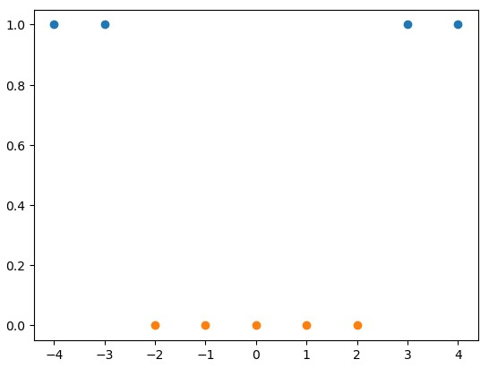

# Questions
## Question - Chap8-PolynomialRegression
[多项式曲线和老师得到的不一样](src/Chap8-PolynomialRegression/error/error.md)

## Question - Chap11- SVM-支撑向量机
11-7.md

生成一个和第一个参数长度相等的值为0的数组
```python
import numpy as np
import matplotlib.pyplot as plt
x  = np.arange(-4, 5, 1)
y = np.array((x >= -2) & (x<=2), dtype = 'int')
plt.scatter(x[y==0], [1]*len(x[y==0])) 
plt.scatter(x[y==1], [0]*len(x[y==1]))
```


## Question - Chap12 - 决策树
12-3.md

对iris 2维数据做决策树分类，通过DecisionTressClassifier和通过自己的代码得到的结果（第一个决策点）是不一样的。 


## 正态分布的概率分布函数怎么画？
Chap3 numpy.md


## PCA & kNN/GD
PCA不用做数据归一化，如果做了会导致数据分布发生变化? 但要做归零处理，每个特征全部减去均值，只是把数据在坐标轴上进行移位，没有改变数据的分布。
kNN&GD需要做数据归一化，变成均值为0， 方差为1的无偏数据

### MINIST 数据集不用做归一化处理？ 
Video 7-7
PCA不用做归一化，只需要做demean，但是这里为什么又提到归一化? 


### Question
precision_score再添加一个参数就可以支持多分类问题。 