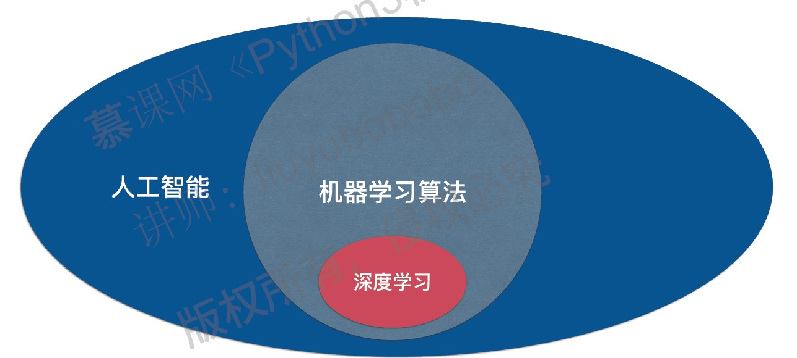

成体系的介绍机器学习算法：

|   |   |
| ---- | ----- |
| kNN | SVM |
| 线性回归 | 决策树 |
| 多项式回归 | 随机森林 |
| 逻辑回归 | 集成学习 |
| 模型正则化 | 模型选择 |
| PCA | 模型调试 |

- 深入理解算法基本原理
- 实际使用算法解决真实场景中的问题
- 对不同算法进行对比试验
- 对同一算法的不同参数进行对比试验
- 对部分算法底层编码
- 如何评价算法的好坏
- 如何解决过拟合和欠拟合
- 如何调节算法的参数
- 如果验证算法的正确性

机器学习库: scikit-learn
课程环境：
- 语言: Python 3
- 框架: Scikit-learn
- 其他： Numpy， matplotlig， pandas, ...
- IDE: Jupyter Notebook - Anaconda
