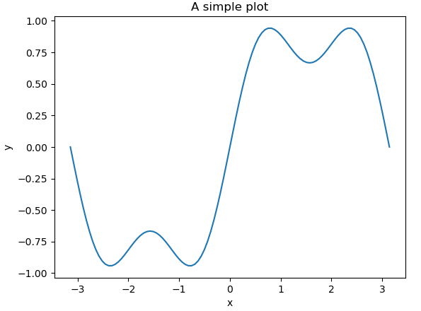
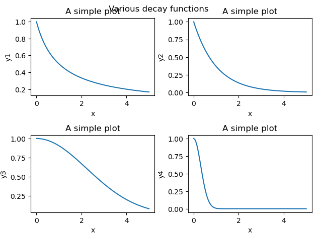
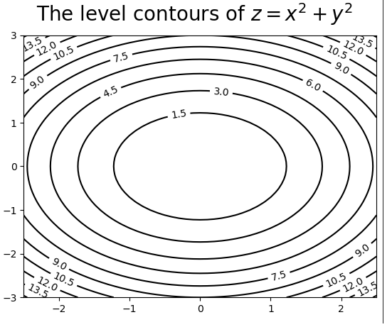
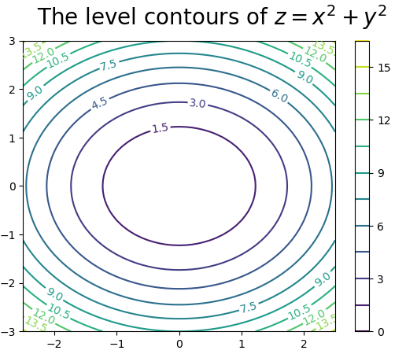

# Matplotlib 学习笔记

Matplotlib是Numpy的附加组件，输出Matlab质量的图形。 使用类的面向对象的方式。
图形 (Figure) 类实例等同于艺术家称为 "画布" 的东西。一个图形中可能有一个或者多个轴 (Axes)类的实例。轴 (Axes)代表坐标轴 (一个X轴和一个y轴) 的集合！  
在使用中，如果直接调用 plt.plot() 绘图，则会默认创建一个图形类和一个轴.

下面两段代码生成同一个图形:
```python
import numpy as np
import matplotlib.pyplot as plt
x = np.linspace(-np.pi, np.pi, 101)
y = np.sin(x)+np.sin(3*x)/3.0
fig = plt.figure()
ax = fig.add_subplot(121)
ax.plot(x, y)
ax.set_xlabel('x')
ax.set_ylabel('y')
ax.set_title('A simple plot')
```
```python
import numpy as np
import matplotlib.pyplot as plt
x = np.linspace(-np.pi, np.pi, 101)
y = np.sin(x)+np.sin(3*x)/3.0
plt.plot(x, y)
plt.xlabel('x')
plt.ylabel('y')
plt.title('A simple plot')
```


在一个图形中绘制多个坐标轴

```python
x = np.linspace(0, 5, 101)
y1 = 1.0/(x+1.0)
y2 = np.exp(-x)
y3 = np.exp(-0.1*x**2)
y4 = np.exp(-5*x**2)

fig = plt.figure() # 构造一个图形类对象
ax1 = fig.add_subplot(221) #构造一个轴子图类对象
ax1.plot(x, y1)
ax1.set_xlabel('x')
ax1.set_ylabel('y1')
ax1.set_title('A simple plot')#设置子图的标题
ax2 = fig.add_subplot(222)#参数也可以写成 (2, 2, 2)
ax2.plot(x, y2)
ax2.set_xlabel('x')
ax2.set_ylabel('y2')
ax2.set_title('A simple plot')
ax3 = fig.add_subplot(223)
ax3.plot(x, y3)
ax3.set_xlabel('x')
ax3.set_ylabel('y3')
ax3.set_title('A simple plot')
ax4 = fig.add_subplot(224)
ax4.plot(x, y4)
ax4.set_xlabel('x')
ax4.set_ylabel('y4')
ax4.set_title('A simple plot')
fig.tight_layout()
fig.suptitle('Various decay functions') #绘制标题
```


绘制等高线 - 也称水平线，是一种在二维平面显示3D图像的方法

```python
import numpy as np
import matplotlib.pyplot as plt
fig = plt.figure()
ax = fig.add_subplot(111)
[X, Y]=np.mgrid[-2.5:2.5:51j, -3:3:61j]
Z=X**2+Y**2
curves = ax.contour(X,Y,Z,12,colors='k')
ax.clabel(curves)
fig.suptitle(r'The level contours of $z=x^2+y^2$', fontsize=20)
```


绘制带颜色的等高曲线图

```python
import numpy as np
import matplotlib.pyplot as plt
fig = plt.figure()
ax = fig.add_subplot(111)
[X, Y]=np.mgrid[-2.5:2.5:51j, -3:3:61j]
Z=X**2+Y**2
curves = ax.contour(X, Y, Z, 12)#用contourf可以得到颜色填充的等高曲线图
ax.clabel(curves)
fig.suptitle(r'The level contours of $z=x^2+y^2$', fontsize=20)
fig.colorbar(curves, orientation='vertical')
```
