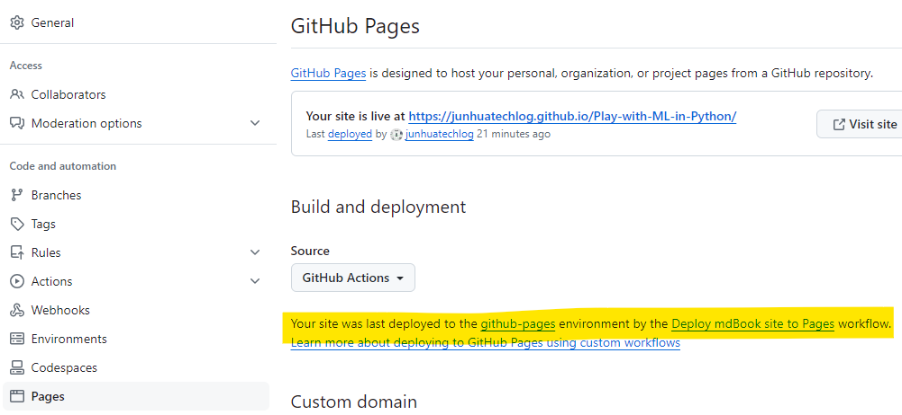
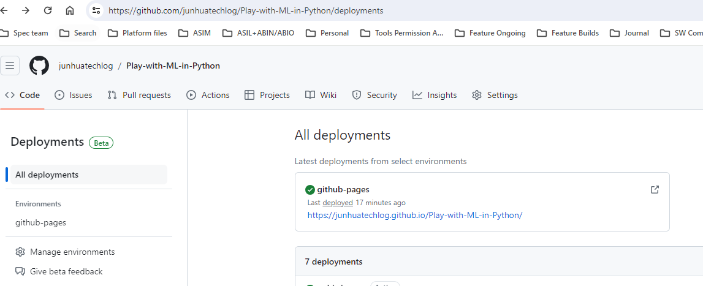

# mdbook 创建和部署steps

根据 [mdbook guide](https://rust-lang.github.io/mdBook/guide/creating.html) 在本地创建一个mdbook的repo. 

```markdown
mdbook init my-first-book
cd my-first-book
mdbook serve --open
```

把 repo push 到 github server之后，需要设置 github pages，并设置 workflow (使用默认的 yml 文件就可以)，使每一次commit都会trigger rebuild 和 redeployment. redeployment之后可以看到生成的book的link. 





