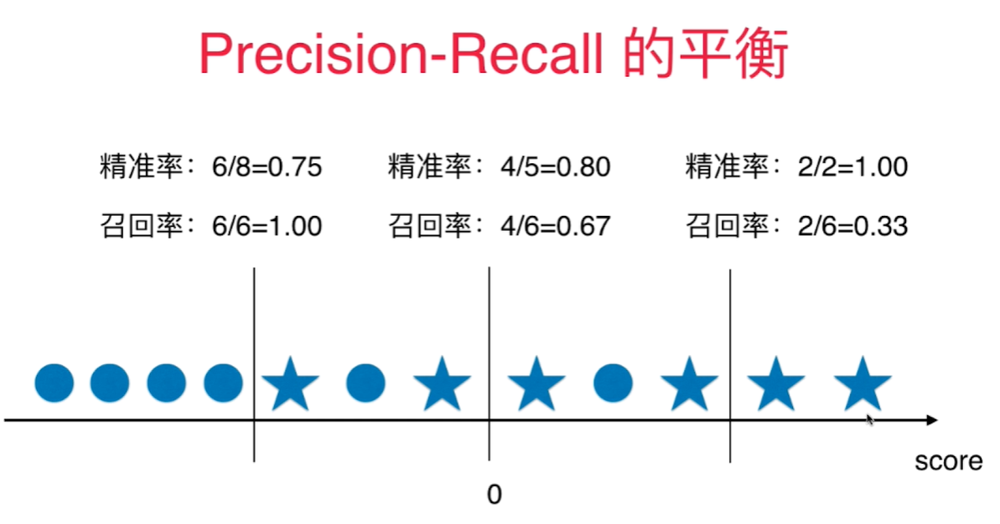

# 精准率和召回率的平衡
下图圆圈代表真值为0， 五角星代表真值为1，score(既横轴)代表每个样本点的score, 0代表默认的决策边界， 既 $ \theta^T \cdot x_b = 0$.  
当决策边界往右移动时, 既 $\theta^T\cdot x_b=Val, val>0$， 精准率提高，召回率下降。   
当决策边界往左移动时, 既 $\theta^T\cdot x_b=Val, val<0$， 召回率提高，精准率下降。   




精准率和召回率的平衡通过调整分类为1的阈值来完成， 像逻辑回归分类算法通过计算出一个score值，通过score值是否> < 0来具体分类的算法中，**sklearn自带一个函数： decision_function(). 做决策的函数**。

将X_test传入得到一维向量，其中包含每个样本对应的score值。 

sklearn.metrics包含混淆矩阵生成函数，求精准度, 召回率, 和 f1 score 的函数。
不包含修改决策边界阀值的函数，如果要修改，只能通过 decision_function() 间接修改。 


测试数据:

```python
import numpy as np
import matplotlib.pyplot as plt
from sklearn.datasets import load_digits
X = load_digits().data
y = load_digits().target
y = np.array( y == 9, dtype='int')
from sklearn.linear_model import LogisticRegression
log_reg = LogisticRegression(solver = 'liblinear')
from sklearn.model_selection import train_test_split
X_train, X_test, y_train, y_test = train_test_split(X, y, random_state = 666)
log_reg.fit(X_train, y_train)
y_predict = log_reg.predict(X_test)
log_reg.score(X_test, y_test)
```
求解混淆矩阵:
```python
from sklearn.metrics import confusion_matrix
confusion_matrix(y_test, y_predict)
```
```python
array([[403,   2],
       [  9,  36]], dtype=int64)
```

求解精准度, 召回率, 和f1 score：
```python
from sklearn.metrics import precision_score
from sklearn.metrics import recall_score
from sklearn.metrics import f1_score
precision_score(y_test, y_predict)
recall_score(y_test, y_predict)
```

```python
0.9473684210526315
0.8
```

通过调整决策边界的阀值(threshold)， 可以调整精准度和召回率：

把 $>=5$ 设为决策边界的阀值:
```python
scores = log_reg.decision_function(X_test)
y_5 = np.array(scores>=5)
confusion_matrix(y_test, y_5)
precision_score(y_test, y_5)
recall_score(y_test, y_5)
```
结果：
```python
array([[404,   1],
       [ 21,  24]], dtype=int64)
0.96
0.5333333333333333
```

把 $>=-5$ 设为决策边界的阀值:
结果：

```python
array([[390,  15],
       [  5,  40]], dtype=int64)
0.7272727272727273
0.8888888888888888
```