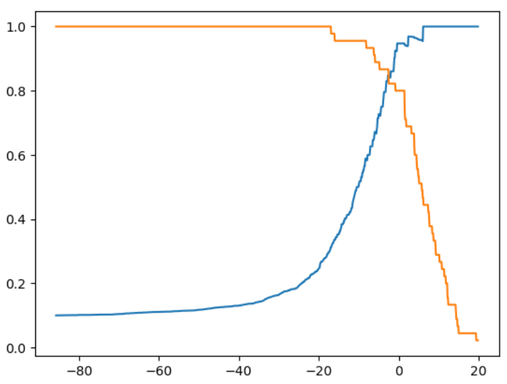
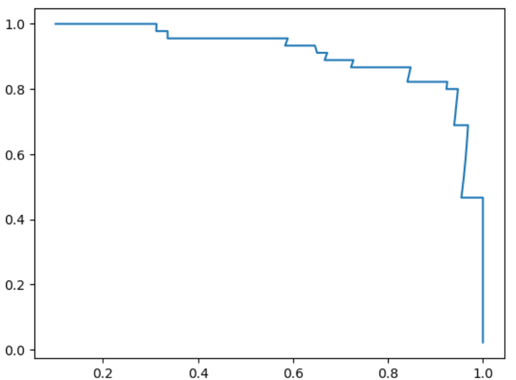

# 精准率-召回率曲线

我们可以通过遍历threshold值来计算出各个threshold值对应的precision/recall 值，然后画出这两条曲线：
```python
import numpy as np
import matplotlib.pyplot as plt
from sklearn.datasets import load_digits
X = load_digits().data
y = load_digits().target
y = np.array( y == 9, dtype='int')
from sklearn.linear_model import LogisticRegression
log_reg = LogisticRegression(solver = 'liblinear')
from sklearn.model_selection import train_test_split
X_train, X_test, y_train, y_test = train_test_split(X, y, random_state = 666)
log_reg.fit(X_train, y_train)
y_predict = log_reg.predict(X_test)
```

绘制精准率和召回率曲线：
```python
from sklearn.metrics import precision_score
from sklearn.metrics import recall_score
decision_scores = log_reg.decision_function(X_test)
from sklearn.metrics import recall_score
thresholds = np.arange(np.min(decision_scores), np.max(decision_scores), 0.1)
precisions = []
recalls = []
for threshold in thresholds:
    y_predict = np.array(decision_scores >= threshold, dtype='int')
    precisions.append(precision_score(y_test, y_predict))
    recalls.append(recall_score(y_test, y_predict))
	
plt.plot(thresholds, precisions[:-1])
plt.plot(thresholds, recalls[:-1])
```



也可以用precision和recall值，画出precision-recall曲线，从该曲线里可以看到随着precision值增大，recall值逐渐下降。存在一个零界点，从这个点开始，曲线急剧下降，这个点就是最好的平衡点。




sklearn.metrics也提供了 precision_recall 曲线绘制函数 `precision_recall_curve()`:

```python
from sklearn.metrics import precision_recall_curve
precisions, recalls, thresholds = precision_recall_curve(y_test, decision_scores)
plt.plot(thresholds, precisions[:-1])
plt.plot(thresholds, recalls[:-1])
```

