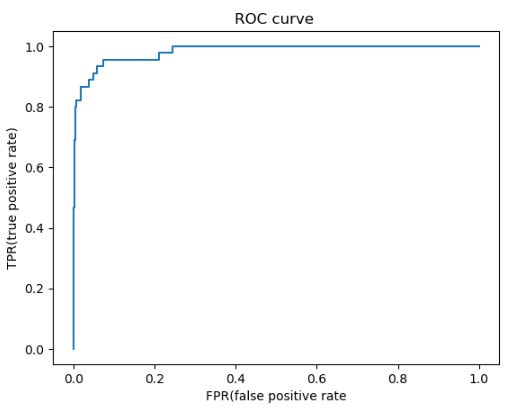
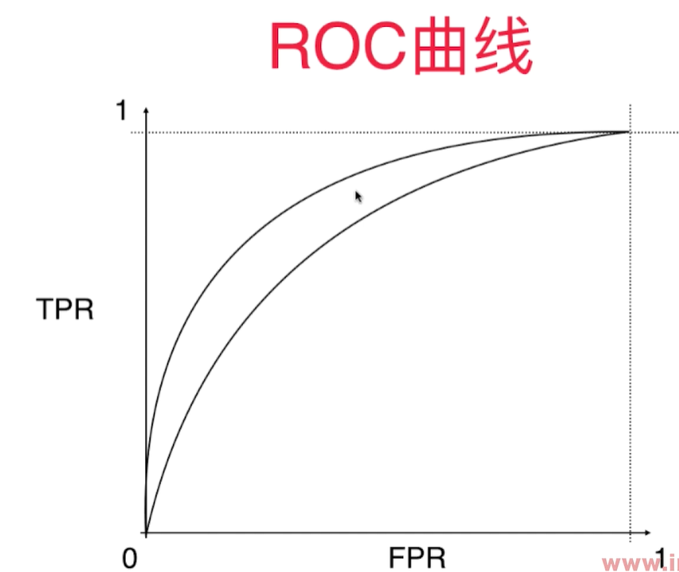

# ROC曲线 - Receiver Operation Characteristic Curve

统计学上的概念，用于描述 TPR 和 FPR 之间的关系。 


**TPR \(真正率\)** \= Recall score \= $\frac {TP} {TP + FN}$ \= 召回率

预测值为1， 并且预测对了的数量占真实值为1的样本比率。

**$$ TPR = Recall\ score$$**

**FPR \(False Positive Rate 假阳性率\)** \= $FPR=\frac{FP}{TN+FP}$  

预测值为1， 但是预测错了的样本和真实值为0的样本的比率。 - 犯了false positive的错误 - 预测错的正样本 占 全体正样本 的比例，也叫**误识别率、虚警率**。

TPR 和FPR呈现相一致的趋势，当决策阈值逐渐降低时，TPR和FPR的值逐渐增大。 


在playML中实现TPR和FPR：
```python
def TPR(y_true, y_predict):
    return Recall_Score(y_true, y_predict)

def FPR(y_true, y_predict):
    fp = FP(y_true, y_predict)
    tn = TN(y_true, y_predict)
    try:
        return fp/(fp + tn)
    except:
        return 0.0
```

在notebook里调用：
```python
import numpy as np
import matplotlib.pyplot as plt
import sys
sys.path.append(r'C:\\N-20KEPC0Y7KFA-Data\\junhuawa\\Documents\\00-Play-with-ML-in-Python\\Jupyter')
from playML.metrics import TPR
from playML.metrics import FPR

from sklearn.datasets import load_digits
X = load_digits().data
y = load_digits().target
y = np.array( y == 9, dtype='int')
from sklearn.linear_model import LogisticRegression
log_reg = LogisticRegression(solver = 'liblinear')
from sklearn.model_selection import train_test_split
X_train, X_test, y_train, y_test = train_test_split(X, y, random_state = 666)
log_reg.fit(X_train, y_train)
#y_predict = log_reg.predict(X_test)
decision_scores = log_reg.decision_function(X_test)

thresholds = np.arange(np.min(decision_scores), np.max(decision_scores), 0.1)
tprs = []
fprs = []
for threshold in thresholds:
    y_predict = np.array(decision_scores >= threshold, dtype='int')
    fprs.append(FPR(y_test, y_predict))
    tprs.append(TPR(y_test, y_predict))
	
plt.plot(fprs, tprs)
```

## Sklearn 中的ROC曲线和AUC
```python
from sklearn.metrics import roc_curve
fpr, tpr, thresholds = roc_curve(y_test, decision_scores)
plt.plot(fpr, tpr)
plt.title("ROC curve ")
plt.xlabel("FPR(false positive rate")
plt.ylabel("TPR(true positive rate)")
```
```python
from sklearn.metrics import roc_auc_score# 求ROC曲线下的面积
roc_auc_score(y_test, decision_scores)
```
`0.9830452674897119`

sklearn.metrics.roc_auc_score - 用于求取ROC曲线下的面积， area under curve.

这个面积越大，这个算法越好。最大值为1.



**这个指标对于有偏数据不敏感，不像precision score和recall score那么敏感**。 所以， 对于有偏数据，用precision score和recall score 看其性能是非常有必要的。 

而ROC/AUC曲线主要用于比较两个模型性能的优劣。 - 要选取AUC面积更大的模型。 



