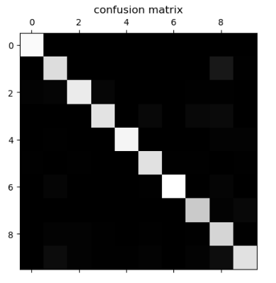
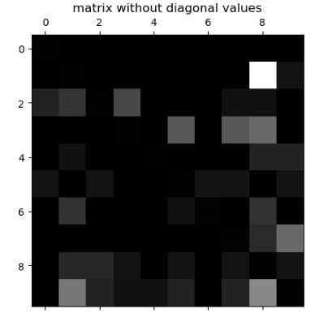

# 多分类问题中的混淆矩阵

sklearn.metrics里的confusion_matrix() 可以直接用于多分类标签场合。
测试代码：

```python
import numpy as np
import matplotlib.pyplot as plt
from sklearn.datasets import load_digits
X = load_digits().data
y = load_digits().target

from sklearn.linear_model import LogisticRegression
log_reg = LogisticRegression(solver = 'liblinear')
from sklearn.model_selection import train_test_split
X_train, X_test, y_train, y_test = train_test_split(X, y, test_size=0.8)
```

用matplotlib的matshow() 函数可以查看混淆矩阵的图像：
```python
log_reg.fit(X_train, y_train)
log_reg.score(X_test, y_test)
y_predict = log_reg.predict(X_test)
from sklearn.metrics import confusion_matrix
cfm = confusion_matrix(y_test, y_predict)
plt.matshow(cfm, cmap=plt.cm.gray)
```
```python
array([[146,   0,   0,   0,   0,   0,   0,   0,   0,   0],
       [  0, 129,   0,   0,   0,   0,   0,   0,  14,   1],
       [  2,   3, 137,   4,   0,   0,   0,   1,   1,   0],
       [  0,   0,   0, 133,   0,   5,   0,   5,   6,   0],
       [  0,   1,   0,   0, 143,   0,   0,   0,   2,   2],
       [  1,   0,   1,   0,   0, 131,   1,   1,   0,   1],
       [  0,   3,   0,   0,   0,   1, 149,   0,   3,   0],
       [  0,   0,   0,   0,   0,   0,   0, 118,   2,   5],
       [  0,   2,   2,   1,   0,   1,   0,   1, 124,   1],
       [  0,   7,   2,   1,   1,   2,   0,   2,   8, 131]], dtype=int64)
```


为了把焦点放在错误上，应该把对角线上的值抹去，然后每一个统计值除以总的样本数得到错误率:

```python
cfm = confusion_matrix(y_test, y_predict)
row_sums = cfm.sum(axis=1, keepdims=True)
norm_cfm = cfm/row_sums
np.fill_diagonal(norm_cfm, 0)
plt.matshow(norm_cfm, cmap=plt.cm.gray)
```



precision_score再添加一个参数就可以支持多分类问题。 
