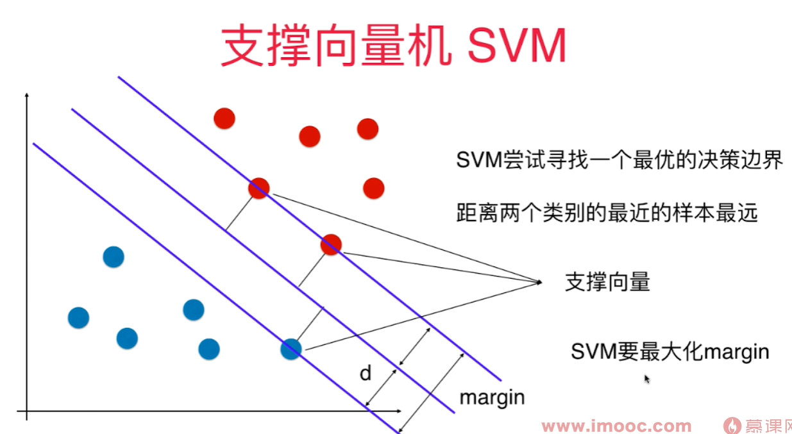

# SVM - support vector machine 支撑向量机

不适定问题 - 决策边界不唯一

需要找到一条线，能很好的区分两种类别，同时临近直线的样本点离这条直线要尽可能远。 

找到一个决策边界，不仅能对训练数据集进行很好的划分， 同时，泛化能力尽可能好！**对泛化能力考量没有放在预处理阶段，而是放在算法内部**。 - 统计学习中非常重要的方法。 

margin 是和决策边界平行的两条直线间的距离，这两条直线分别穿过两类样本的临近点。 

线性可分问题： 存在一个超平面，可以把两类样本分开 - **Hard Margin SVM**

真实环境中样本可能是线性不可分的，所以是一个**Soft margin SVM 算法**

