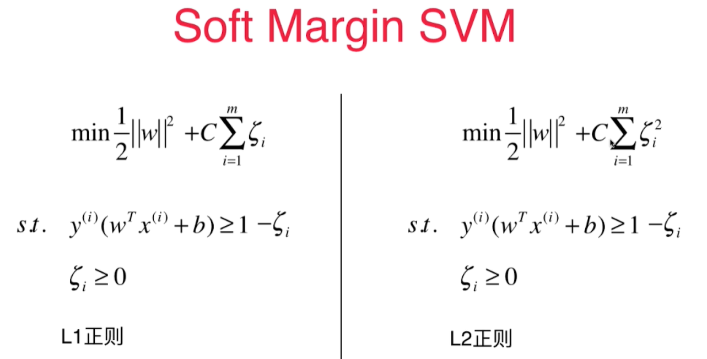

# Soft Margin SVM 和SVM 正则化

SVM 决策边界要有一定的容错性，目的是达到泛化能力更高！ - Soft Margin SVM

Margin区域里任何样本点都不应该有，改进 - 加上一个宽松量 $\zeta$

$$w^Tx + b = 1 - \zeta \ \ \  \zeta \ge 0 $$ 
每一个样本点，都有一个对应的 $\zeta$, 也就是每个样本点，都有对应的容错空间。 

每个样本点要有容错空间，同时容错空间又不能太大，因为太大了，所有的样本点都可以包含在Margin里面。 为了避免这种情况，在损失函数里加入一项 $\sum_{i=1}^m\zeta_i$, 后半部分加上一个大C来平衡两者的比率。 

$$Loss function = min \frac12\rVert w \rVert ^2 + C\sum_{i=1}^m\zeta_i$$

**SVM 是一个有条件的最优化问题**，
这个模型加入了L1正则项， 让模型对训练数据集有更高的容错能力， 对训练集中的极端数据点不敏感。 

L2正则：
$$Loss function = min \frac12\rVert w \rVert ^2 + C\sum_{i=1}^m\zeta_i^2$$

C的位置和逻辑回归（线性回归）等的不一样， 但是表意是一样。 如果C越大，则容错空间越小。C越小，则意味着有更大的容错空间。 

