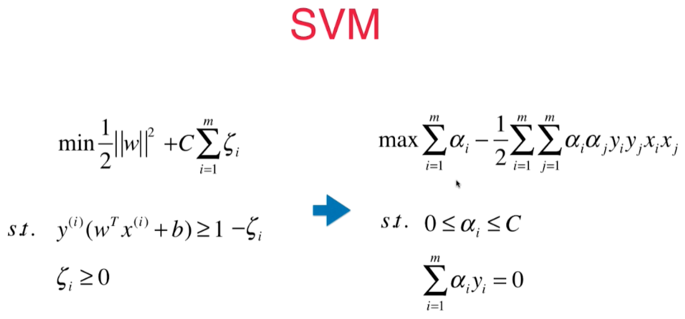

# 核函数 - 多项式核为例

SVM 求解一个有条件的最优化问题，在数学上需要变形成另一个数学问题： 

在多项式 SVM中，$x_ix_j$ （向量点积）需要将两个向量添加上多项式项再进行运算，
**核函数**就是不需要先做多项式转换， 而通过一个函数(核函数)直接计算出多项式转换之后的点乘运算结果

$$K(x^{(i)}, x^{(j)}) = x^{'(i)}x^{'(j)}$$

kernel function - kernel trick(技巧)

**变形通常是把一个低维样本变成高维数据，会花很多存储空间。** 
核函数可以避免这个过程，可以减少计算量，和存储空间, 降低计算复杂度。 - 不是SVM特有的技巧！

## 二次多项式核函数：

**$$K(x, y) = {(x\cdot y+1)}^2$$ **

这个核函数就是在原来样本上添加了二次方的数据。有些参数前面有 $\sqrt 2$, 因为这只是一个系数，在求解出来的系数里除去这个系数即可，不影响功能。 通过核函数，不再需要将二次方数据得到然后做运算，而是通过原来的样本数据即可以运算得到添加二项式项之后的运算结果。

## 多项式核函数：
$$K(x, y) = {(x\cdot y+C)}^d$$
C和d(degree)是超参数

## 线性核函数
$$K(x, y) = {(x\cdot y)}$$