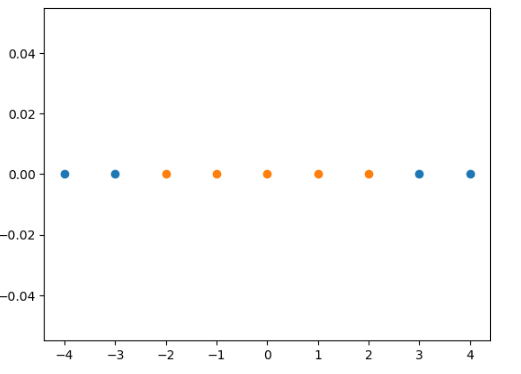
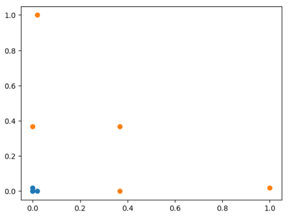

# 高斯核函数

$K(x, y)$ 表示x和y的点乘:
$$K(x, y) = e^{-\gamma {\rVert x - y\rVert}^2}$$

Radio Basis Function Kernel(RBF核)

将原来的样本点映射成新的数据向量，再做点乘。- 将每一个样本点映射到一个无穷维的特征空间 

多项式特征是依靠升维使得原本线性不可分的数据线性可分。 

landmark $l_1, l_2$ 地标
假设有2个地标 $l_1, l_2$， 对于每一个x，将其映射为一个二维坐标如下:
 
 $$ x \to (e^{-\gamma {\rVert x - l_1\rVert}^2}, e^{-\gamma {\rVert x - l_2\rVert}^2}) $$

因为在高斯核函数中，每一个样本点都是一个landmark，每个样本点都要对所有样本点做运算， 因此它是将m\*n的数据映射成了m\*m的数据。

高斯核函数计算开销大，初始样本维度很高，但是样本点不多，及m < n的情况下，则用RBF有优势。


## 高斯核函数将1维数据映射到二维空间

一维数组，> -2, < 2的数为1， 其他为0， 在一维空间无法区分
```python
import numpy as np
import matplotlib.pyplot as plt
x  = np.arange(-4, 5, 1)
y = np.array((x >= -2) & (x<=2), dtype = 'int')
plt.scatter(x[y==0], [0]*len(x[y==0]))
plt.scatter(x[y==1], [0]*len(x[y==1]))
```


通过RBF转换为二维数组:

```python
def gaussian(x, l):
    gamma = 1.0
    return np.exp(-gamma * (x - l)**2)

l1, l2 = -1, 1

X_new = np.empty((len(x), 2))
for i, data in enumerate(x):
    X_new[i, 0] = gaussian(data, l1)
    X_new[i, 1] = gaussian(data, l2)
	
plt.scatter(X_new[y==0, 0], X_new[y==0, 1])
plt.scatter(X_new[y==1, 0], X_new[y==1, 1])
```


Question, [0] 无法理解:
```python
plt.scatter(x[y==0], [0]*len(x[y==0]))
plt.scatter(x[y==1], [0]*len(x[y==1]))

```