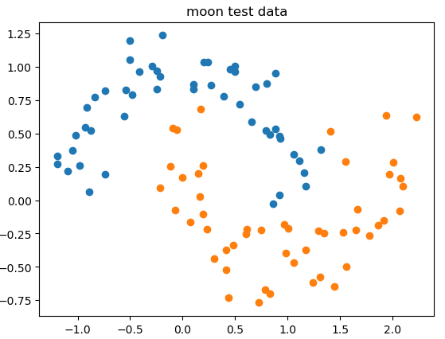
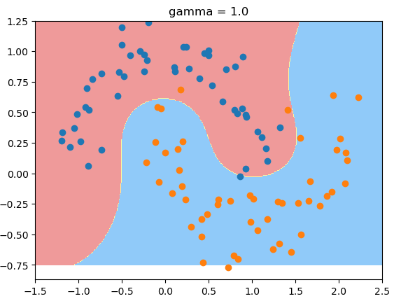
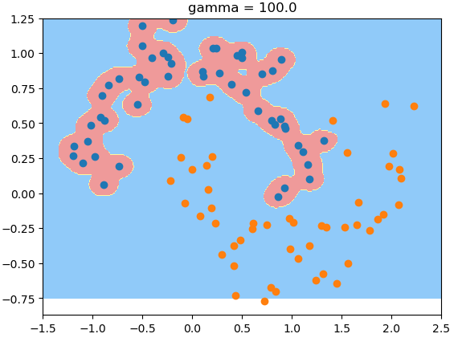
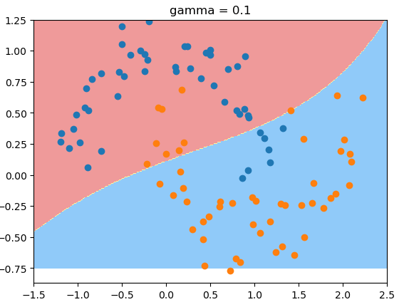

# RBF核函数中的gamma

$\mu$ 代表高斯分布中的中心轴的位置；
$\sigma$ 代表标准差，描述样本数据分布的情况！$\sigma$ 越小，分布曲线越窄，越大，分布曲线越缓，越宽. 

RBF里：
gamma越大，高斯分布越窄；
gamma越小，高斯分布越宽。

测试数据：
```python
import numpy as np
import matplotlib.pyplot as plt
from sklearn import datasets
X, y = datasets.make_moons(noise = 0.15, random_state=666)
plt.scatter(X[y==0, 0], X[y==0, 1])
plt.scatter(X[y==1, 0], X[y==1, 1])
```

gamma值为1时的决策边界：

```python
from sklearn.preprocessing import StandardScaler
from sklearn.svm import SVC
from sklearn.pipeline import Pipeline
def RBFKernelSVC(gamma = 1.0):
    return Pipeline([
    ("std_scaler", StandardScaler()),
    ("svc", SVC(kernel="rbf", gamma = gamma))
    ])
svc = RBFKernelSVC()
svc.fit(X, y)
def plot_decision_boundary(model, axis):
    x0, x1 = np.meshgrid(
        np.linspace(axis[0], axis[1], int((axis[1] - axis[0])*100)).reshape(-1, 1), 
        np.linspace(axis[2], axis[3], int((axis[3] - axis[2])*100)).reshape(-1, 1)
    )
    X_new = np.c_[x0.ravel(), x1.ravel()]

    y_predict = model.predict(X_new)
    zz = y_predict.reshape(x0.shape)

    from matplotlib.colors import ListedColormap
    custom_cmap = ListedColormap(['#EF9A9A', '#FFF59D', '#90CAF9'])
    plt.contourf(x0, x1, zz, cmap=custom_cmap)

plot_decision_boundary(svc, [-1.5, 2.5, -0.75, 1.25])
plt.scatter(X[y==0, 0], X[y==0, 1])
plt.scatter(X[y==1, 0], X[y==1, 1])
```


gamma值为100时，过拟合：



gamma值为0.1时，欠拟合:




gamma值实际上在调整模型的复杂度，当gamma值越小，则模型复杂度越低(underfitting)。gamma越高 复杂度越高(overfitting).
