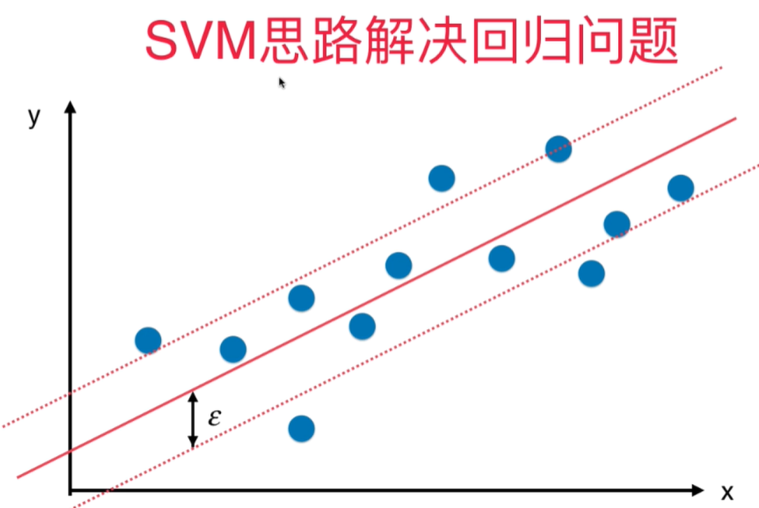

# 使用SVM解决回归问题

与分类问题相反，回归问题的区别是希望在margin里面的样本尽可能多，而不是尽可能少。

在训练SVM回归模型时，对于margin的大小是可以设定的，所以引入一个超参数：$\epsilon$, 代表上下两个直线，任意一根到中间这条直线的距离。 



```python
from sklearn.svm import LinearSVR # SVM解决回归问题的类, Support vector regression
from sklearn.svm import SVR # 可以传入不同的核 
from sklearn.preprocessing import StandardScaler
from sklearn.pipeline import Pipeline
def StandardLinearSVR(epsilon= 0.1):
    return Pipeline([
        ("std_scaler", StandardScaler()),
        ("linearSVR", LinearSVR(epsilon=epsilon))
    ])
svr = StandardLinearSVR()
svr.fit(X_train, y_train)
svr.score(X_test, y_test)
```


测试数据：

```python
import numpy as np
import matplotlib.pyplot as plt
from sklearn import datasets
import pandas as pd
data= pd.read_csv("boston_house_prices.csv", skiprows=[0])
array = data.values
X = array[:, :13]
y = array[:, 13]
X = X[y<50.0]
y = y[y<50.0]
from sklearn.model_selection import train_test_split
X_train, X_test, y_train, y_test = train_test_split(X, y, random_state=666)
```