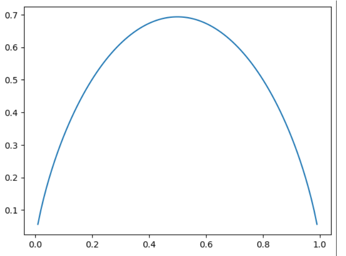

# 信息熵

信息熵在信息论中代表随机变量不确定的度量。-  系统中的不确定性的度量
- 熵越大，数据的不确定性越高
- 熵越小，数据的不确定性越低


热力学中引申出来：
熵越大，在一个热力系统中 ，那些粒子无规则运动就越剧烈；不确定性越高；
熵越小，粒子越倾向于静止，确定性越高！


$$H = - \sum_{i=1}^k p_i log(p_i) $$

$$H = -x log(x) - (1-x) log(1-x)$$

画出二分类的entropy曲线：
```python
import numpy as np
import matplotlib.pyplot as plt
def entropy(p):
    return -p * np.log(p) - (1-p) * np.log(1-p)
x = np.linspace(0.01, 0.99, 100);
plt.plot(x, entropy(x))
```

从图中可知，当两则概率都是0.5的时候，熵是最大的，最不确定的。 


在决策树中，在每个节点上都是在一个维度上对数据做划分，划分的结果是使得系统整体的信息熵降低。 让系统变得更加确定。 最终，每个叶子上都是相同的数据集，这时候系统的熵为0。  - 通过搜索获得最好的划分（熵最低）
