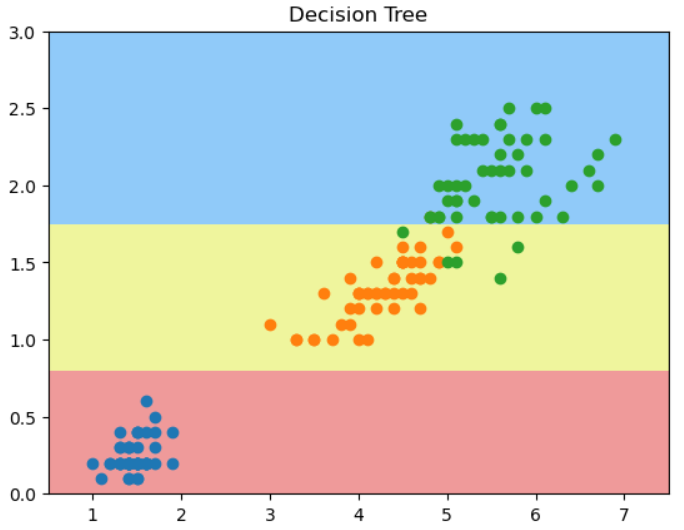

# 使用信息熵寻找最优划分
鸢尾花二维数据：
```python
import numpy as np
import matplotlib.pyplot as plt
from sklearn import datasets
data = datasets.load_iris()
X = data.data[:, 2:]
y = data.target
from sklearn.tree import DecisionTreeClassifier
dtc_clf = DecisionTreeClassifier(max_depth = 2, criterion='entropy')
dtc_clf.fit(X, y)

def plot_decision_boundary(model, axis):
    x0, x1 = np.meshgrid(
        np.linspace(axis[0], axis[1], int((axis[1] - axis[0])*100)).reshape(-1, 1), 
        np.linspace(axis[2], axis[3], int((axis[3] - axis[2])*100)).reshape(-1, 1)
    )
    X_new = np.c_[x0.ravel(), x1.ravel()]

    y_predict = model.predict(X_new)
    zz = y_predict.reshape(x0.shape)

    from matplotlib.colors import ListedColormap
    custom_cmap = ListedColormap(['#EF9A9A', '#EFF59D', '#90CAF9'])

    plt.contourf(x0, x1, zz, cmap=custom_cmap)
    
plot_decision_boundary(dtc_clf, [0.5, 7.5, 0, 3])
plt.scatter(X[y==0, 0], X[y==0, 1])
plt.scatter(X[y==1, 0], X[y==1, 1])
plt.scatter(X[y==2, 0], X[y==2, 1])
plt.title("Decision Tree")
```
和老师的结果有出入，第一个决策点不在x轴上，而在y轴上? 


## 自己编写通过entropy来分类的决策树代码

```python
from collections import Counter
def split(X, y, d, value):
    index_a = X[:, d] <= value
    index_b = X[:, d] > value
    return X[index_a], X[index_b], y[index_a], y[index_b]

def entropy(y):
    counter = Counter(y)
    res = 0.0
    for v in counter.values():
        p = v/len(y)
        res += -p * np.log(p)
    return res

def try_split(X, y):
    best_entropy = float('inf')
    best_d, best_v = -1, -1
    for d in range(X.shape[1]):
        sorted_index = np.argsort(X[:, d])
        for i in range(1, len(X)):
            if X[sorted_index[i-1], d] != X[sorted_index[i], d]:
                v = (X[sorted_index[i-1], d]+X[sorted_index[i],d])/2
                X_l, X_r, y_l, y_r = split(X, y, d, v)
                e = entropy(y_l) + entropy(y_r)
                if e < best_entropy:
                    best_entropy, best_d, best_v = e, d, v
    return best_entropy, best_d, best_v
```

### 求第一个决策点：
```python
best_entropy, best_d, best_v =  try_split(X, y)
print("best_entropy = ", best_entropy)
print("best_d = ", best_d)
print("best_v = ", best_v)
```
结果：
```python
best_entropy, best_d, best_v =  try_split(X, y)
print("best_entropy = ", best_entropy)
print("best_d = ", best_d)
print("best_v = ", best_v)
```
`(0.6931471805599453, 0, 2.45)`

### 求第二个决策点
```python
X_l, X_r, y_l, y_r = split(X, y, 0, 2.45)
best_entropy2, best_d2, best_v2 = try_split(X_r, y_r)
print("best_entropy = ", best_entropy2)
print("best_d = ", best_d2)
print("best_v = ", best_v2)
X2_l, X2_r, y2_l, y2_r = split(X_r, y_r, 1, 1.75)
entropy(y2_l)
entropy(y2_r)

```
```
best_entropy =  0.4132278899361904
best_d =  1
best_v =  1.75

0.30849545083110386
0.10473243910508653
```

