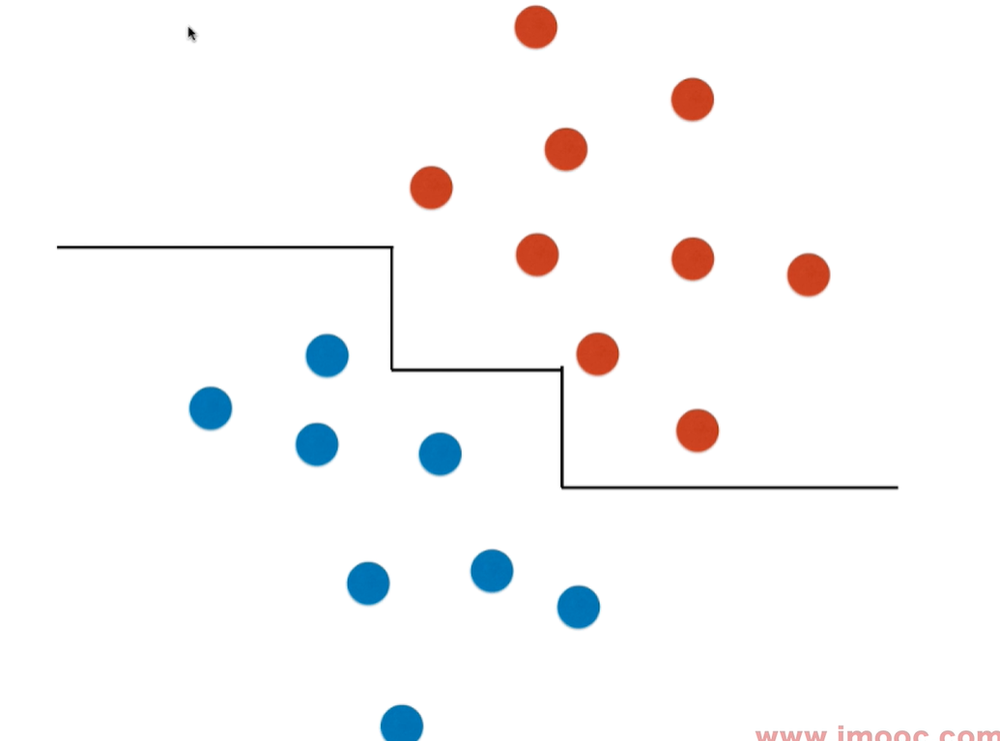

# 决策树的局限性

局限性： 
**决策边界是横平竖直的，真实的决策边界可能是一条斜线，而决策树永远不可能产生这样的决策边界。** 
对于一个二分类清晰的样本，假如旋转一个角度，则会导致产生的决策边界是锯齿形的，而这个边界的远端肯定是不对的，因为它不是一条斜线。

**对个别数据点非常敏感。 - 非参数学习算法的共同特点 - 非常依赖于调参**

看到书上说，sklearn中的决策树使用的算法是随机的，即对于每个决策树的节点都是随机选择
特征集进行评估，所以，得到的特征边界会不一样。 也证明了对数据点很敏感。 

