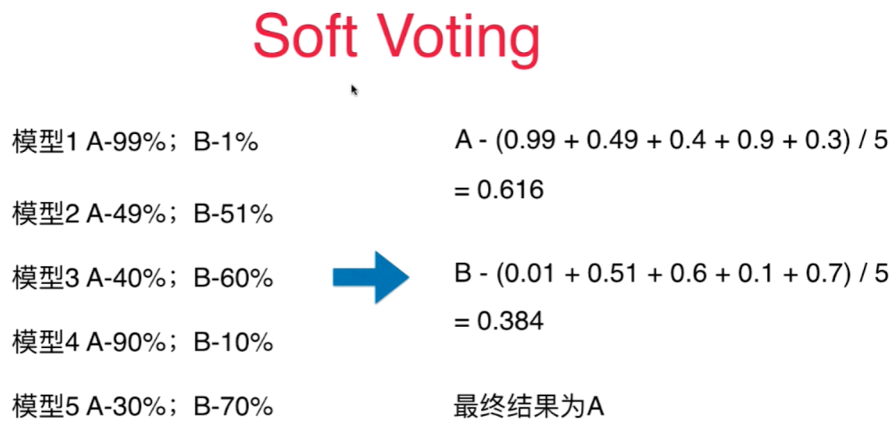
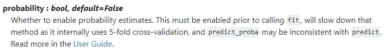
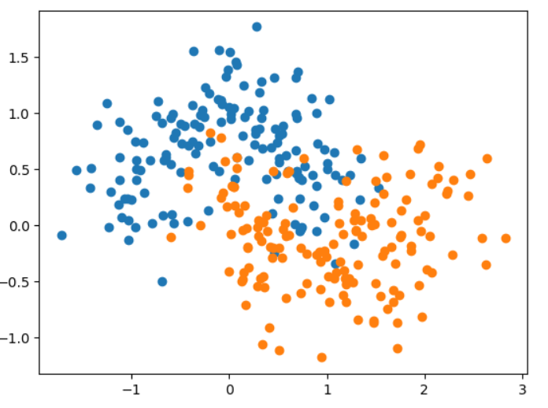

# Soft Voting Classifier

**Hard Voting: 少数服从多数**
**Soft Voting: 基于权值的投票**

民主暴政： 一人一票结果反而不好，最好是对不同的算法的结果应该要有权值的。
唱歌比赛的投票，那些老师权值高。 
对于经济政策的推出，经济领域的专家的意见权值应该更高！

虽然只有2个模型的预测结果是A类，但是他们都非常确定结果是A类。 有3个模型将结果分成B类，但是每一个的预测概率并不高。


对分类结果的概率求和做平均，得到最终的概率，根据这个概率值来决定最终的分类结果。 - **Soft Voting**
- 要求集合的每一个模型都能估计概率

SVM算法目的是寻找最大的margin，没有考虑计算概率。**但是SVC中有一个probability参数，默认是False，而设成True时会计算每个预测值的概率，但会牺牲性能。** 



测试数据：
```python
import numpy as np
from sklearn.model_selection import train_test_split
import matplotlib.pyplot as plt
from sklearn import datasets
X, y = datasets.make_moons(n_samples = 300, noise = 0.3, random_state=42)
X_train, X_test, y_train, y_test = train_test_split(X, y, random_state = 42)
plt.scatter(X[y==0, 0], X[y==0, 1])
plt.scatter(X[y==1, 0], X[y==1, 1])
```


hard Voting：
```python
from sklearn.ensemble import VotingClassifier
from sklearn.tree import DecisionTreeClassifier
from sklearn.svm import SVC
from sklearn.linear_model import LogisticRegression
vc_clf_hard = VotingClassifier(estimators=[
 ('log_clf', LogisticRegression()),
 ('svm_clf', SVC()),
 ('dt_clf', DecisionTreeClassifier(random_state=666))   
], voting = 'hard')
vc_clf_hard.fit(X_train, y_train)
vc_clf_hard.score(X_test, y_test)

```
结果:
`0.88`

Soft Voting：
```python
vc_clf = VotingClassifier(estimators=[
 ('log_clf', LogisticRegression()),
 ('svm_clf', SVC(probability=True)),
 ('dt_clf', DecisionTreeClassifier(random_state=666))   
], voting = 'soft')
vc_clf.fit(X_train, y_train)
vc_clf.score(X_test, y_test)
```
结果：
`0.9066666666666666`