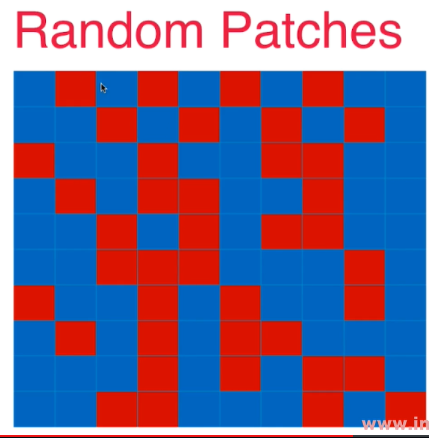

# OOB(Out of Bag) 和关于Bagging的更多讨论

放回取样会导致一部分样本很可能没有取到。$37%$ - Out of bag

使用这些没有用过的样本做测试/验证就好了。 - 不需要再做训练/测试数据集分离了。 - 创建时加上`bootstrap=True`参数
**oob_score_**

```python
%%time
bagging_clf2 = BaggingClassifier(DecisionTreeClassifier(), n_estimators=5000, max_samples=100, bootstrap=True) # bagging - 放回取样
bagging_clf.fit(X, y)
bagging_clf.oob_score_#读取验证的结果
```
结果：

```python
CPU times: total: 781 ms
Wall time: 1.01 s
```

Bagging的思路极易做并行化处理，因为每一个子模型是独立的。- 创建时加上`n_jobs=-1`，充分利用多核处理器
```python
%%time
bagging_clf = BaggingClassifier(DecisionTreeClassifier(), n_estimators=500, max_samples=100, bootstrap=True, oob_score = True, n_jobs=-1) # bagging - 放回取样
bagging_clf.fit(X, y)
```
结果：

```python
CPU times: total: 297 ms
Wall time: 1.18 s
```


让每一个子模型产生差异化：
    - 每个子模型使用一个小的样本集
    - 针对特征进行随机采样 - Random Subspaces - 随机子空间
    - 既针对样本，又针对特征进行随机采样 - Random Patches - 2个维度都是随机的，产生的图片就像一块有很多补丁的布


在特征空间进行随机采样的方式又叫 bootstrap_featrues。
max_features #每次随机采样的特征数量
bootstrap_features=True#激活特征空间随机采样

```python
bagging_clf = BaggingClassifier(DecisionTreeClassifier(), n_estimators=500, max_samples=100, bootstrap=True, oob_score = True, n_jobs=-1, max_features=1, bootstrap_features=True) # bagging - 放回取样
bagging_clf.fit(X,
bagging_clf.oob_score_
```
结果：
`0.8466666666666667`# 因为总共只有2个特征，效果不明显

用决策树实现的BaggingClassifier就是**随机森林**，因为每一个子模型都是一个决策树。


测试代码：

```python
import numpy as np
from sklearn.model_selection import train_test_split
import matplotlib.pyplot as plt
from sklearn import datasets
X, y = datasets.make_moons(n_samples = 300, noise = 0.3, random_state=42)
X_train, X_test, y_train, y_test = train_test_split(X, y, random_state = 42)
plt.scatter(X[y==0, 0], X[y==0, 1])
plt.scatter(X[y==1, 0], X[y==1, 1])
```