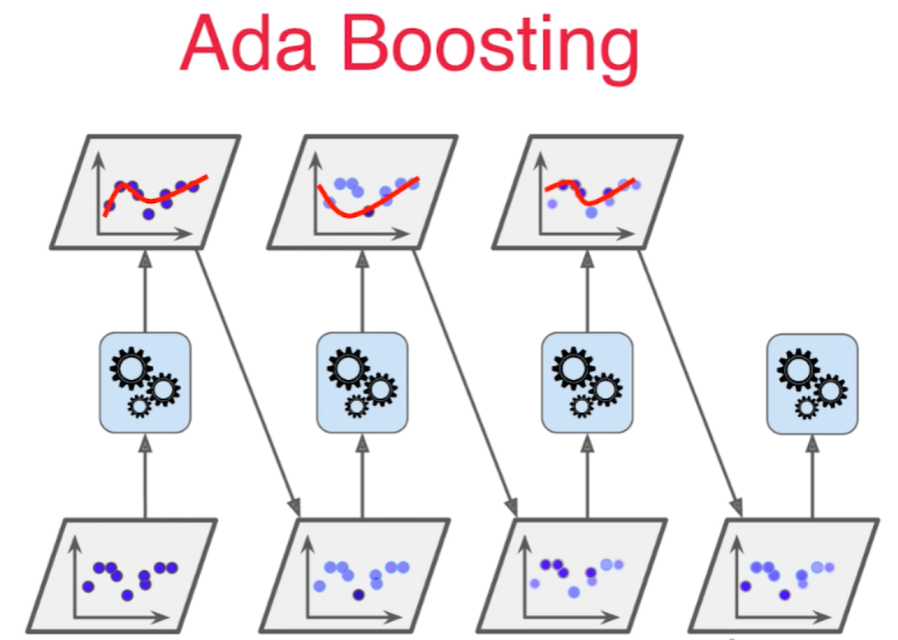
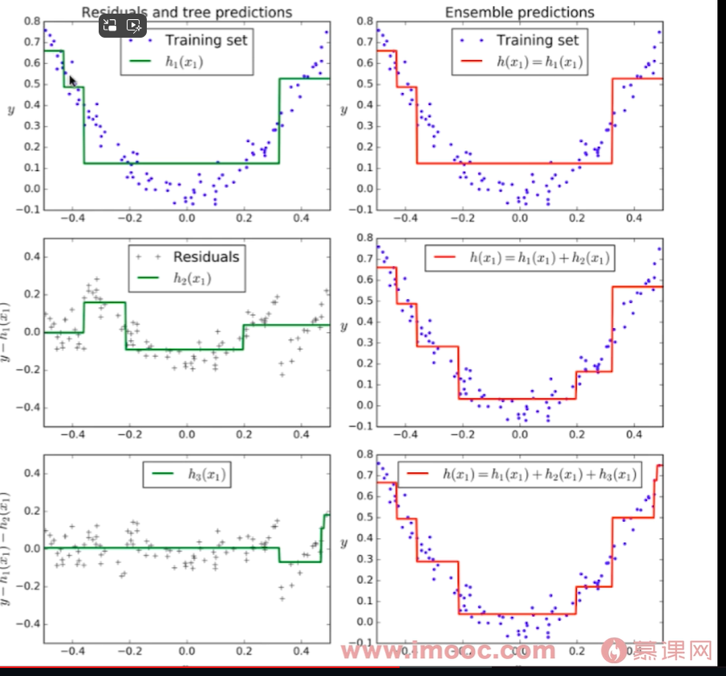

# Ada Boosting 和Gradient Boosting
Boosting 类的算法，有分类器，也有回归器
```python
from sklearn.ensemble import AdaBoostingRegressor
from sklearn.ensemble import GradientBoostingRegressor
```

**集成多个模型，每个模型都在尝试增强(Boosting)整体的效果**。

初始时，所有的样本点权重是一样的，在第二次训练时，增加和第一次拟合出来的曲线距离较远的点的权重，再拟合，第三次再对第二次拟合出来的曲线相距较远的点提高权重再拟合。每次拟合的算法可能不一样。 



```python
from sklearn.tree import DecisionTreeClassifier
from sklearn.ensemble import AdaBoostClassifier
ada_clf = AdaBoostClassifier(DecisionTreeClassifier(max_depth=2), n_estimators=500)
ada_clf.fit(X_train, y_train)
```

### Gradient Boosting

对整体数据集用模型m1训练， 产生错误e1， 再用e1训练第二个模型m2, 产生错误e2，针对e2训练第三个模型m3，产生错误e3, ... 最终预测结果是： m1+m2+m3+...

每个模型都是对前一个模型所犯错误的补偿。 




这种方法是基于决策树作为base estimator的，所以不像Ada Boosting，不需要设置base estimator。 

```python
from sklearn.ensemble import GradientBoostingClassifier
gb_clf = GradientBoostingClassifier(max_depth=2, n_estimators=30)
gb_clf.fit(X_train, y_train)
gb_clf.score(X_test, y_test)
```
