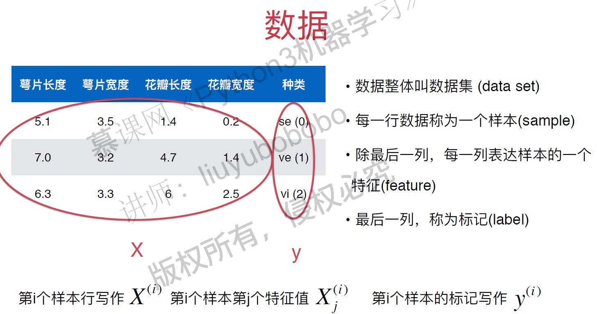
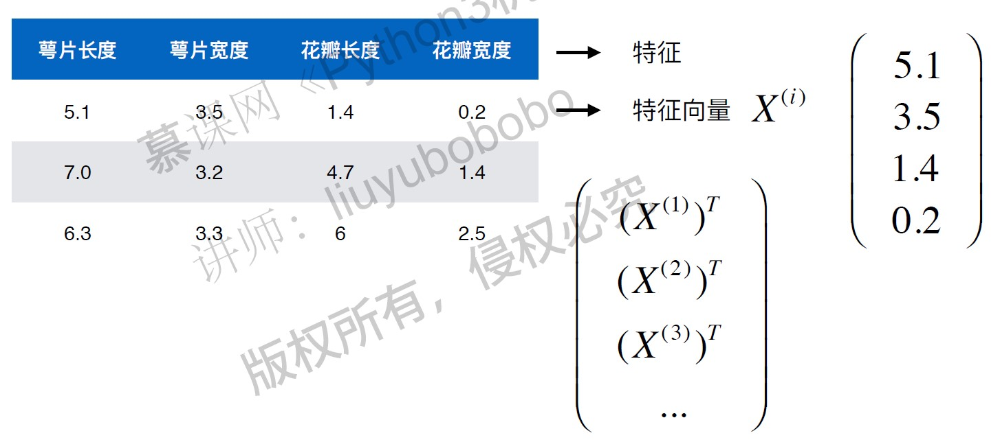
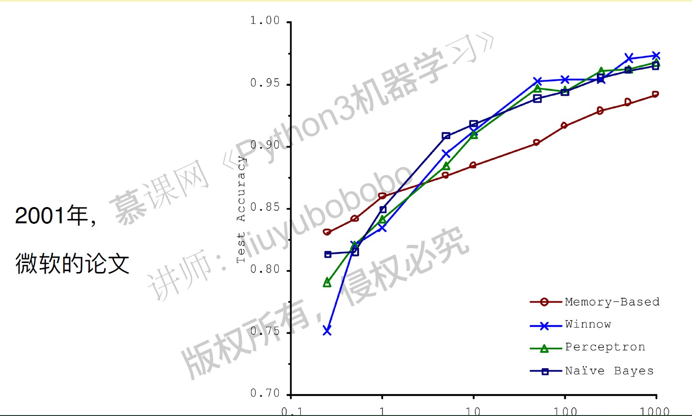

# 机器学习基础

所有的特征向量组成了一个特征空间，分类任务本质就是在特征空间切分。
机器学习的基本任务：
- 分类
- 回归 - 得到的结果是一个连续数字的值，而非一个类别。
监督学习： 给机器的训练数据拥有“标记”或者“答案”。
非监督学习：给机器的训练数据没有任何“标记”或者“答案”。意义：
    - 对没有标记的数据进行分类 - 聚类分析
    - 对数据进行降维处理（方便可视化），比如
      - 特征提取：信用卡的信用评级和人的胖瘦无关？
      - 特征压缩： PCA
    - 异常检测
  
  半监督学习： 一部分数据有“标记”或者“答案”， 另一部分数据没有， 通常都先使用无监督学习手段对数据做处理，之后使用监督学习手段做模型的训练和预测。

  增强学习： 根据周围环境的情况， 采取行动， 根据采取行动的结果，学习行动方式。 
    - 无人驾驶
    - 机器人
  

  机器学习的其他分类：
  - 在线学习(online learning)和批量学习（离线学习）(Batch learning)
  - 参数学习和非参数学习(Parametric and Nonparameteric learning)
    - 参数学习的特点： 一旦学到了参数，就不再需要原有的数据集
    - 非参数学习不对模型进行过多假设，非参数不等于没参数！
  
  

  # 没有免费的午餐定理
  - 可以严格的数学推导出：任意两个算法，他们的期望性能是相同的！
  - 具体到某个特定问题，有些算法可能更好！但没有一种算法，绝对比另一种算法好！
  - 脱离具体问题，谈哪个算法好是没有意义的。
  - 在面对一个具体问题的时候，尝试使用多种算法进行对比试验，是必要的。