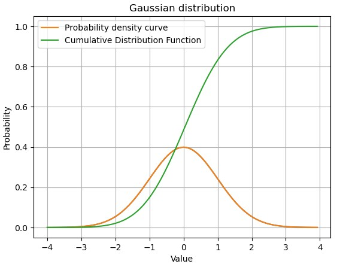

# 创建Numpy数组(和矩阵)
Python的list可以包含不同种类的数据，而Numpy的数组和矩阵只能包含相同类型的数据，这样便于提高运算效率。 

### 查询一个函数的介绍
Return evenly spaced numbers over a specified interval. 返回一个在[start, stop]间均匀分布的数列
```python
import numpy as np
x = np.linspace(-1, 6, 141)
#numpy.linspace(start, stop, num=50, endpoint=True, retstep=False, dtype=None, axis=0)
```
返回一个一维数组，默认返回的是一个包含endpoint的闭区间(default)，如果不想包含endpoint，则endpoint=False.
如果retstep为true则返回一个元组，包含生成的数组和步长。

### hstack()
Stack arrays in sequence horizontally (column wise).
```python
#np.hstack(tup, *, dtype=None, casting='same_kind') 
X = np.linspace(1, 10, num=10).reshape(5, 2)
XX = np.hstack((np.ones((len(X), 1)), X))
XX
array([[ 1.,  1.,  2.],
       [ 1.,  3.,  4.],
       [ 1.,  5.,  6.],
       [ 1.,  7.,  8.],
       [ 1.,  9., 10.]])
```
返回一个由tup里面包含的两个矩阵合并起来的矩阵。新的矩阵依照2个原始矩阵按行拼接而成，所以2个矩阵的行数必须相等。 

### zeros_like()
Return an array of zeros with the same shape and type as a given array.

```python
new_X = np.zeros_like(XX)
new_X
array([[0., 0., 0.],
       [0., 0., 0.],
       [0., 0., 0.],
       [0., 0., 0.],
       [0., 0., 0.]])
```

### random.normal()
Draw random samples from a normal (Gaussian) distribution.
返回正态分布的随机采样, 均值为loc，**标准差**为scale。

np.random.normal(loc=0.0, scale=1.0, size=None)

概率密度函数：
 $$ p(x) = \frac{1}{\sqrt{ 2 \pi \sigma^2 }} e^{ - \frac{ (x - \mu)^2 } {2 \sigma^2}}$$ 

loc : float or array_like of floats 均值
    Mean ("centre") of the distribution.
scale : float or array_like of floats 方差
    **Standard deviation (spread or "width") of the distribution**. Must be
    non-negative.
size : int or tuple of ints, optional
    Output shape.  If the given shape is, e.g., ``(m, n, k)``, then
    ``m * n * k`` samples are drawn.  If size is ``None`` (default),
    a single value is returned if ``loc`` and ``scale`` are both scalars.
    Otherwise, ``np.broadcast(loc, scale).size`` samples are drawn.

### 正态分布的概率密度和分布函数
```python
import numpy as np
import matplotlib.pyplot as plt
x = np.linspace(-4, 4, num=100, endpoint=False)
def gaussian(mu, sigma, x):
    return 1/(np.sqrt(2*np.pi) * sigma) * np.exp(-(x - mu)**2/(2*sigma**2))
y = gaussian(0, 1, x)
plt.plot(x, y)

# 求概率分布函数 
F_sum = np.zeros_like(y, dtype='float')
for i in range(0, 100):
    F = y[:i]
    F_sum[i] = np.sum(F)
    
plt.plot(x, y, label='Probability density curve')
plt.plot(x,F_sum*8/100, label="Cumulative Distribution Function")# 在概率密度函数中，每一个采样点所占的空间是(8/100)
plt.title('Gaussian distribution')
plt.xlabel('Value')
plt.ylabel('Probability')
plt.grid()
plt.legend()
```


### reshape() - 给数组变形
Gives a new shape to an array without changing its data.

np.reshape(a, newshape, order='C')

```python
x = np.random.normal(size=m)
X = x.reshape(-1, 1) # 将一个行向量变成一个矩阵，矩阵有m行，1列宽
X
array([[ 0.58785508],
       [ 0.71235639],
       [ 1.76958186],
       [-0.32010511],
       [-0.08879702],
       [-1.86446786],
       [-0.56338442],
       [ 0.83438846],
       [-0.09859595],
       [ 0.45151806]])
```

### permutation() 
返回一个数组的随机排列，如果是多维的，则只会依据第一维做随机排列。
Randomly permute a sequence, or return a permuted range.

If `x` is a multi-dimensional array, it is only shuffled along its
first index.

```python
x = np.linspace(1, 12, num=12)
new_x = x.reshape((2, 2,3))
np.random.permutation(new_x)
array([[[ 7.,  8.,  9.],
        [10., 11., 12.]],

       [[ 1.,  2.,  3.],
        [ 4.,  5.,  6.]]])
```
### 对一个列表里的值做相同的操作

用python的for循环方式：
```python
def J(theta):
    return (theta-2.5)**2 - 1
theta_history=[1, 2, 3, 4, 5, 6]
theta_y = [J(i) for i in theta_history]
```
用numpy array方式:
``` python
theta_history=[1, 2, 3, 4, 5, 6]
theta_y = J(np.array(theta_history))
```

### 从一个数组中选出满足条件的点

```python
test_list = np.array([3, 2, 1, 4, 7, 2, 3, 4, 9, 8])
index = np.array((test_list >= 3) & (test_list <= 7)) # 从中选出>=3, <=7的点, 返回一个bool型数组
test_list[index]
```
结果：

`array([3, 4, 7, 3, 4])`

# Numpy数组(和矩阵)的基本操作

# Numpy数组(和矩阵)的合并与分割

# Numpy中的矩阵运算

# Numpy中的聚合预算

# Numpy中的arg运算

# Numpy中的比较和Fancy Indexing


X = np.empty((100, 2))
X[:, 0] = np.random.uniform(0, 100, size=100)
X[:, 1] = 0.75*X[:, 0] + 3.0 + np.random.normal(0, 10, size=100)

### 向量的模
向量 AB（AB上面有→）的长度叫做向量的模
```python
    x = np.array([3, 4])
    np.linalg.norm(x) 
    5.0
```