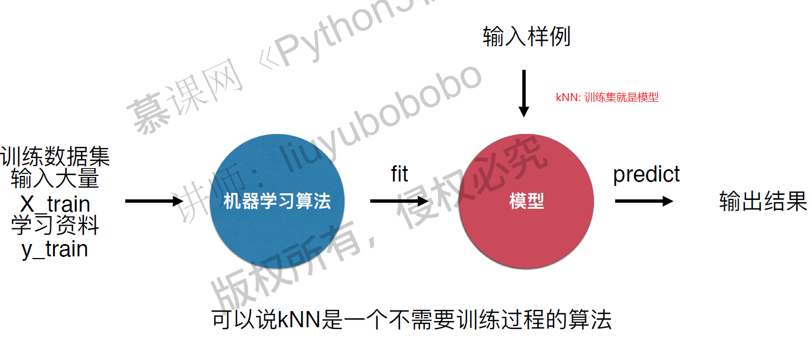
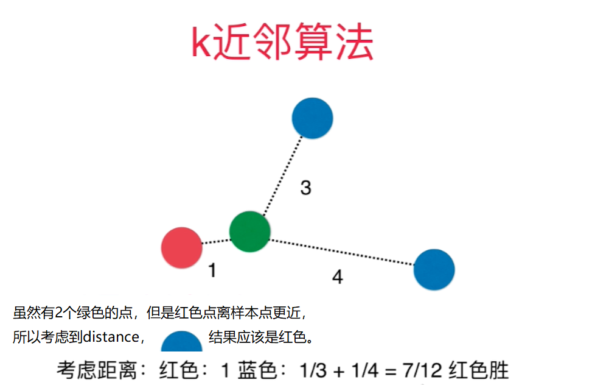
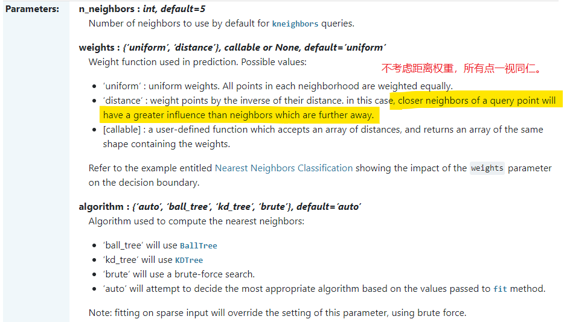
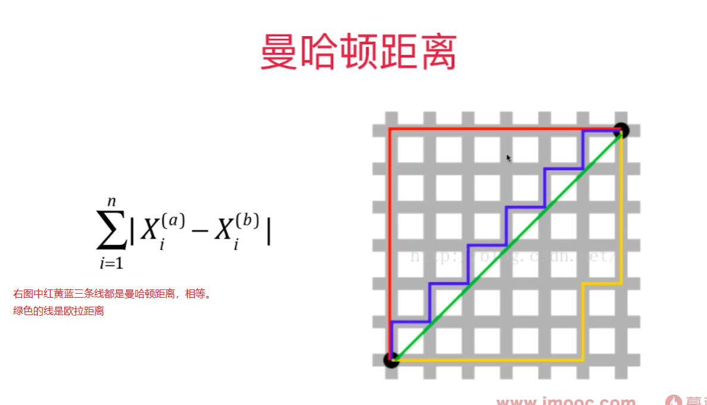
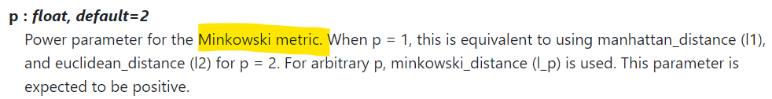

# kNN - k Nearest Neighbors k近邻算法

### 欧拉距离

$$\sqrt{(x^{(a)} - x^{(b)})^2 + (y^{(a)} - y^{(b)})^2}$$

$$\sqrt{(x_1^{(a)} - x_1^{(b)})^2 + (x_2^{(a)} - x_2^{(b)})^2 + ... + (X_n^{(a)} - x_n^{(b)})^2}$$


$$\sqrt {\sum_{i=1}^n (X_i^{(a)} - X_i^{(b)})^2}$$

kNN算法是非常特殊的，可以被认为是没有模型的算法，为了和其他算法统一，可以认为训练数据集就是模型本身。


### 判断机器学习算法的性能
需要将数据集分成训练/测试数据集，通过测试数据直接判断模型的好坏！在模型进入真实环境前改进模型。 `train test split`

### 分类准确度 - accuracy
预测结果和样本结果一致的样本数占所有样本数的比例。

### 超参数和模型参数

超参数： 在机器学习算法运行前需要决定的参数， 比如k

模型参数： 算法在训练过程中学习到的参数

kNN算法没有模型参数，kNN算法中的k是典型的超参数。 
寻找好的超参数依赖
    - 领域知识(视觉搜索，自然语言处理)
    - 经验数值（kNN算法中k默认为5）
    - 实验搜索。

### kNN算法中另一个超参数： 距离

为了让kNN预测结果更合理，需要考虑距离的权重，通常用距离的倒数作为权重。
距离还可以解决平票的问题: 比如和样本点相连的3个点是3中类别,如果不考虑距离权重,则只能从3个中随机选一个作为预测结果,不合理. 

weights: 
    - uniform
    - distance



距离有：
    - 欧拉距离 $\sqrt {\sum_{i=1}^n (X_i^{(a)} - X_i^{(b)})^2}$
    - 曼哈顿距离 $\sum_{i=1}^n \left| X_i^{(a)} - X_i^{(b)} \right| $ 
  代表两个样本点在每个维度上的距离的和
    - 
    - 明可夫斯基距离 Minkowski Distance   $（\sum_{i=1}^n {\left| X_i^{(a)} - X_i^{(b)} \right|}^p）^{\frac 1 p} $

更多距离定义, 可以用相似度来定义样本间的距离：
- 向量空间余弦相似度 Cosine Similarity
- 调整余弦相似度 Adjusted Cosine Similarity
- 皮尔森相关系数 Pearson Correlation Coefficient
- Jaccard 相似系数 Jaccard Coefficient





## 寻找超参数要用网格搜索:

```python
import numpy as np
import matplotlib
import matplotlib.pyplot as plt
from sklearn import datasets
from sklearn.neighbors import KNeighborsClassifier
from sklearn.model_selection import GridSearchCV
from sklearn.model_selection import train_test_split

digits = datasets.load_digits()
X_train, X_test, y_train, y_test = train_test_split(digits.data, digits.target, test_size=0.2, random_state=600)

param_grid = [
    {
        'weights': ['uniform'], 
        'n_neighbors': [i for i in range(1, 11)]
    },
    {
        'weights': ['distance'],
        'n_neighbors': [i for i in range(1, 11)],
        'p': [p for p in range(1, 6)]
    }
]

knn_clf = KNeighborsClassifier()
grid_search = GridSearchCV(knn_clf, param_grid, n_jobs = -1, verbose = 2)
grid_search.fit(X_train, y_train)

# 根据用户传入参数计算得到的参数
grid_search.best_estimator_
grid_search.best_score_
grid_search.best_params_
knn_clf = grid_search.best_estimator_
knn_clf.score(X_test, y_test)
```

```python
Fitting 5 folds for each of 60 candidates, totalling 300 fits
KNeighborsClassifier(n_neighbors=1, p=3, weights='distance')
0.990251161440186
{'n_neighbors': 1, 'p': 3, 'weights': 'distance'}
0.9805555555555555
```

提升计算性能： n_jobs = -1， 用所有的核来计算

verbose: 整数值越大，输出的信息越多

```python
GridSearchCV(knn_clf, param_grid, n_jobs = -1, verbose = 2)
```

