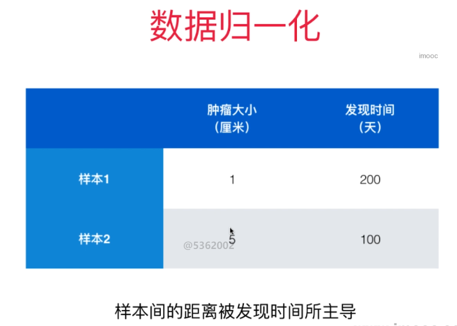
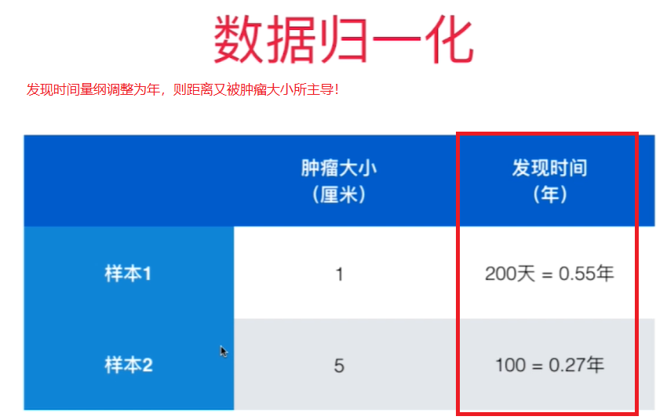
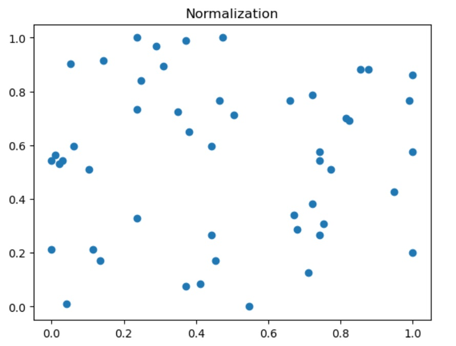
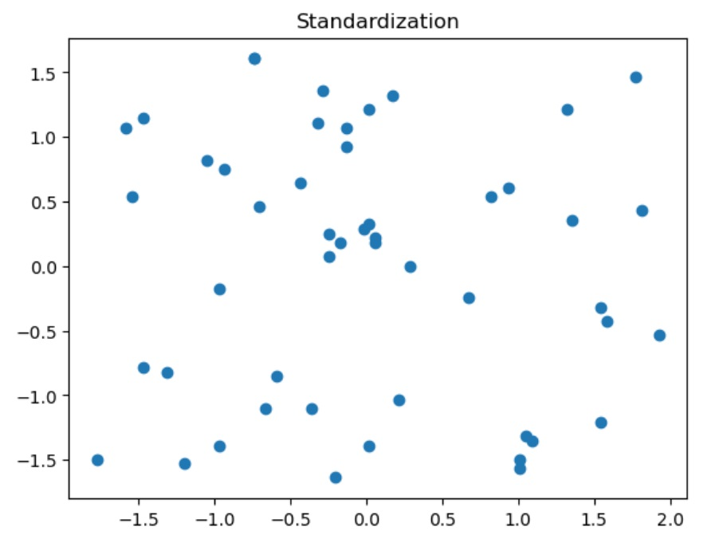

# 数据归一化 Feature Scaling


如果不做数据归一化，因为各个特征量纲不同， 某些特征的数值大小差距比其他特征的数值差距大很多，样本间的距离被个别数值差距大的特征主导。 

<figure class="half">
    
    
</figure>

解决方案：将所有的数据映射到同一个尺度
- **最值归一化**： 把所有的值映射到0-1之间 - Normalization - 最简单的映射
  $$x_{scale} = \frac {x - x_{min}} {x_{max} - x_{min}}$$

  适用于数据分布有明显边界的地方， 比如学生的成绩，像素， 它受Outlier影响较大

  不适合没有明显边界的情况，比如收入分布，有人收入很高，大部分人收入一般，映射后大部分人的值会很低。

- **均值方差归一化**- Standardization 把所有数据归一到均值为0， 方差为1的分布中。这样做了之后不能保证所有的值都在0-1之间，但保证均值为0， 方差为1, 也就不会形成有偏的数据。 
    
    适用于数据没有边界， 有可能存在极值（Outlier）的数据

    如果数据有明显边界，用这个方法效果也是很好的。 

    **所以，一般情况下，都用均值方差归一化**
- 
-    $$x_{scale} = \frac {x - x_{mean}} S$$ S为方差


<figure class="half">
    
    
</figure>

```python
import numpy as np
import matplotlib.pyplot as plt
X = np.random.randint(0, 100, (50, 2))
X = np.array(X, dtype='float')
#最值归一化
for i in range(0, 2):
    X[:,i] = (X[:, i] - np.min(X[:, i]))/(np.max(X[:, i]) - np.min(X[:, i]))
X[:, 0].mean(), X[:, 0].std()
	
plt.scatter(X[:, 0], X[:, 1])
plt.title("Normalization")
```
结果：均值不为0， 方差不为1

`0.47422680412371127, 0.3155110806332136`

```python
# 均值方差归一化
for i in range(0, 2):
    X[:, i] = (X[:, i] - np.mean(X[:, i]))/np.std(X[:, i])
np.mean(X[:, 0]), np.std(X[:, 0]), np.mean(X[:, 1]), np.std(X[:, 1])

plt.scatter(X[:, 0], X[:, 1])
plt.title("Standardization")
```

结果：均值为0， 方差为1， 无偏数据
`1.2878587085651815e-16, 1.0, 1.021405182655144e-16, 0.9999999999999999`