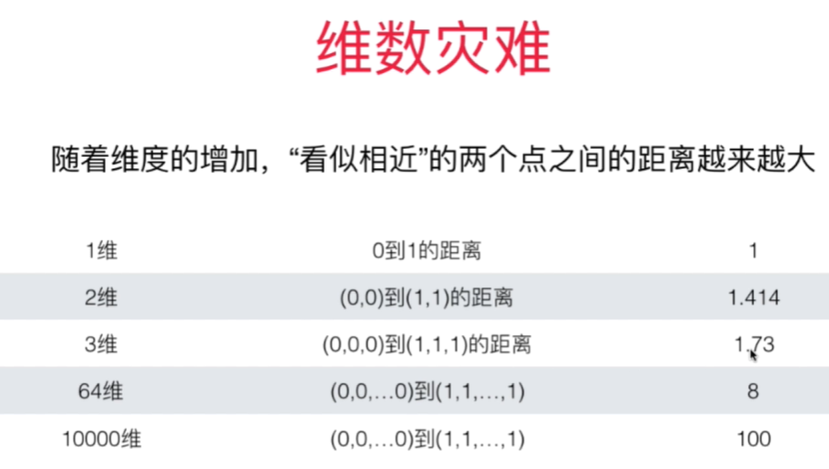
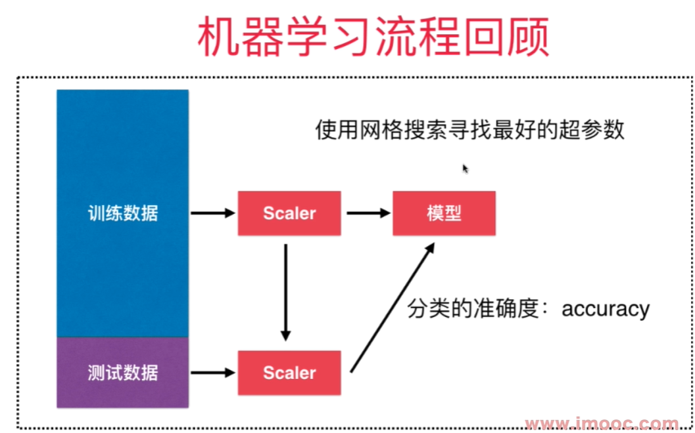

# 更多思考

kNN算法天然的可以解决多分类问题，思想简单，效果强大。

也可以解决回归问题， 找到离样本点最近的k个节点， 求这几个点的平均值就是要求的点的值。 
也可以用加权平均方法。 

**KNeighborsRegressor**

缺点：
- 效率低下， m个样本，n个特征的情况下，每预测一个数据，需要O(m*n)的计算量
    可以使用KD-Tree, ball-tree更快的求出k近邻。 
- 高度数据相关， 对outlier更敏感。 比如k=3，在样本点附近有2个错误的值的点，则结果肯定出错。 
- 预测结果不具有可解释性
- 维数灾难 - 随着维度的增加，看似相近的两个点之间的距离越来越大。- 解决方法： 降维 PCA

- 

