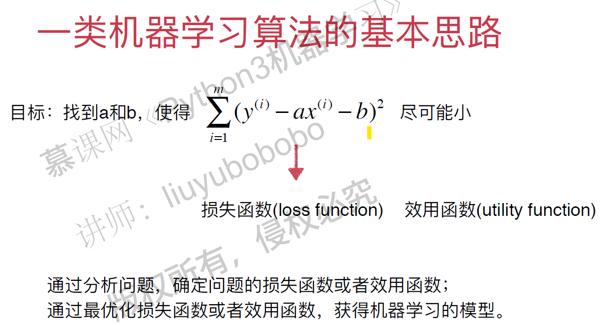
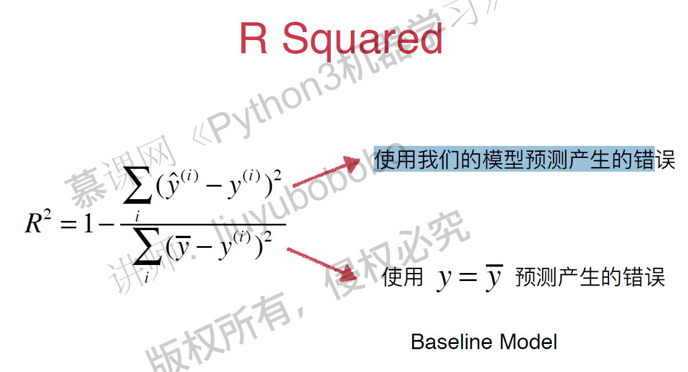
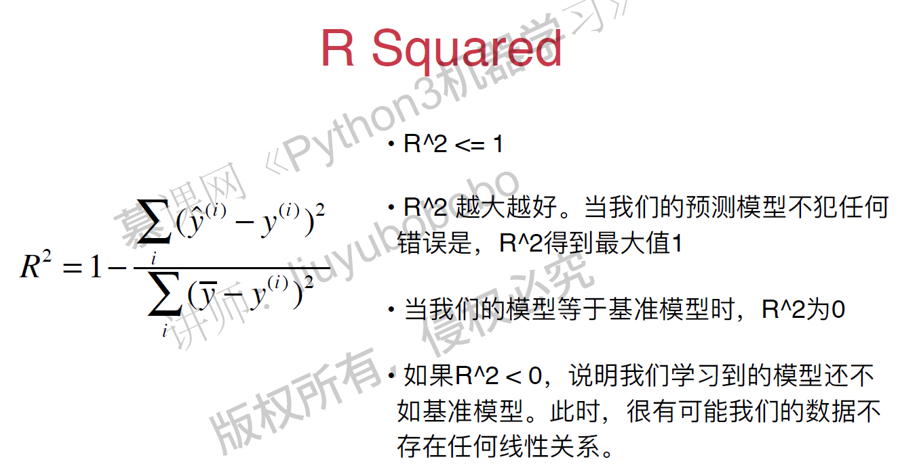
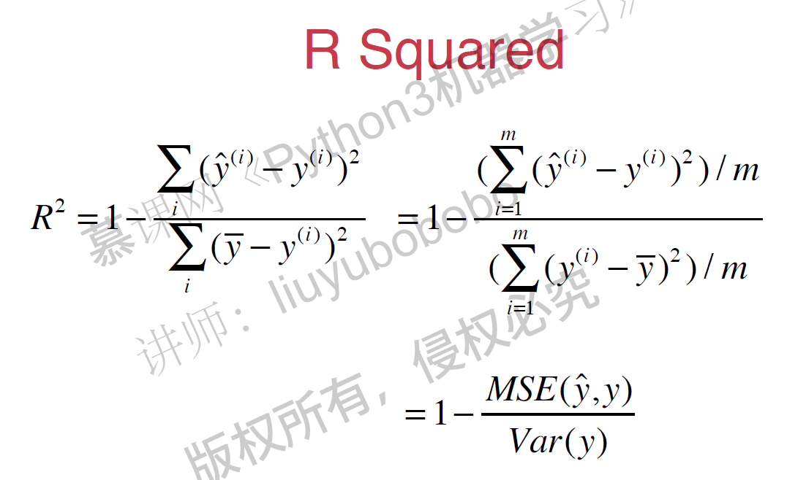

# 线性回归 - Linear Regression

- 解决回归问题
- 是许多强大的非线性模型的基础
- 结果具有良好的可解释性
- 蕴含机器学习中的很多重要的思想

寻找一条直线，最大程度的“拟合”样本特征和样本输出标记之间的关系。

简单线性回归： 样本特征只有一个

目标函数: 使 $\sum_{i=1}^m (y^{(i)} - {\hat y}^{(i)})^2 $ 尽可能小.
$$ {\hat y}^{(i)} = ax^{(i)} + b $$

即：
找到a和b，使得  $\sum_{i=1}^m (y^{(i)} - ax^{(i)} - b)^2 $  尽可能小。

通过分析问题，确定问题的损失函数或者效用函数；
通过最优化损失函数或者效用函数，获得机器学习的模型。近乎所有的参数学习算法都是这样的套路。 

最小二乘法解决简单线性回归问题：
$$ a = \frac {\sum_{i=1}^m (x^{(i)} - \bar x)(y^{(i)} - \bar y)} {\sum_{i=1}^m (x^{i} - \bar x)^2}$$

$$ b = \bar y - a \bar x$$

### 回归算法的衡量 MSE vs. MAE

#### 均方误差 MSE（ Mean Squared Error ) - 量纲是平方
$$ \frac 1 m \sum_{i=1}^m (y_{test}^{(i)} - \hat y_{test}^{(i)})^2$$

#### 均方根误差 RMSE(Root  Mean Squared Error)
$$\sqrt {\frac 1 m \sum_{i=1}^m (y_{test}^{(i)} - \hat y_{test}^{(i)})^2} $$

#### 平均绝对误差 MAE （Mean Absolute Error)

$$ \frac 1 m \sum_{i=1}^m \left| y_{test}^{(i)} - \hat y_{test}^{(i)} \right| $$

#### R Squared

$$R^2 = 1 - \frac {{SS}_{residual}} {{SS}_{total}}$$   $\frac {Resisual\ Sum\ of\ Squared} {Total\ Sum\ of\ Squares} $

$$R^2 = 1 - \frac {\sum_i (\hat y^{(i)} - y^{(i)})^2} {\sum_i (\bar y - y^{(i)})^2}$$

Scikit-Learn中的线性回归法，score默认为R Squared的值。 
