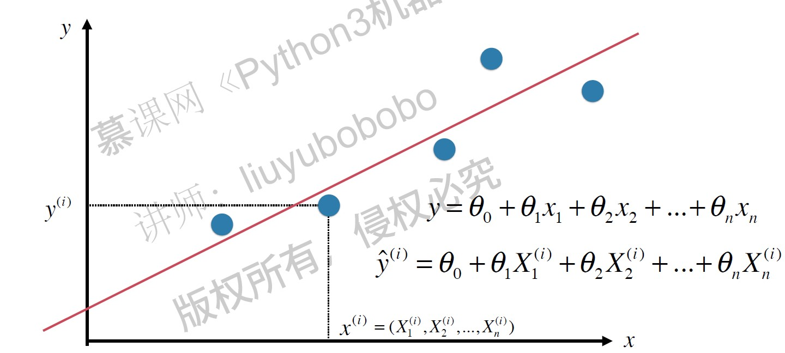
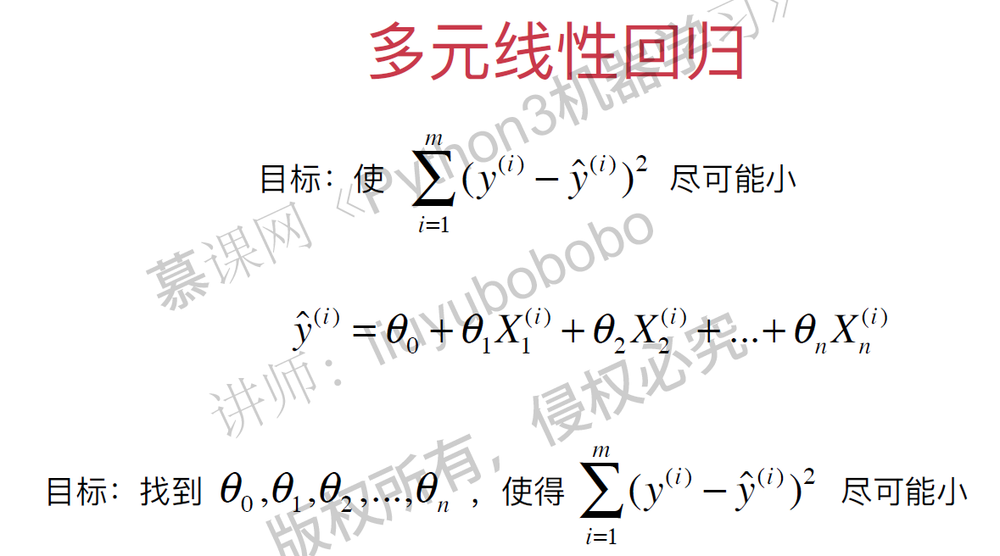
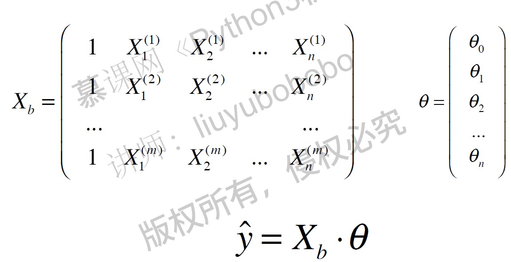
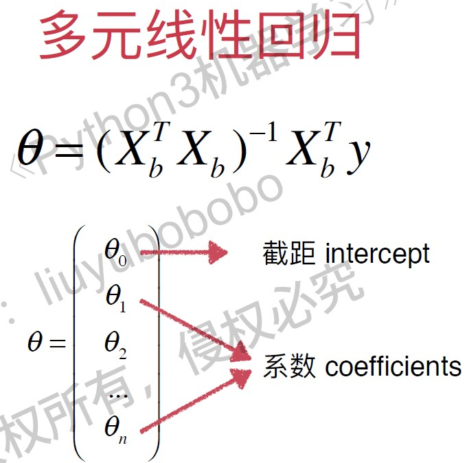

# 多元线性回归

多元线性回归的目标函数：
$$\hat y = X_b \cdot \theta $$
使$ \sum_{i=1}^m(y^{(i)} - {\hat y}^{(i)})^2 $ 尽可能小。
即使 $ (y - X_b \cdot \theta)^T (y-X_b \cdot \theta)$ 尽可能小。

以下是多元线性回归的正规方程解( Normal Equation), 时间复杂度高: $O(n^3)$ (优化后是 $O（n^{2.4})$), 优点是不需要对数据做归一化处理。
**$$ \theta = (X_b^TX_b)^{-1} X_b^T y $$**

**总结：**

| kNN |  Linear Regression    |
| ---- | --- |
| 非参数学习 | 典型的参数学习算法 |
|既可以解决分类问题，又可以解决回归问题| 虽然是很多分类算法的基础(Logistic Regression)， 但是只能解决回归问题 |
|对数据没有假设 | 对数据有线性的假设 |
|对数据无解释性 | 对数据有强解释性 |