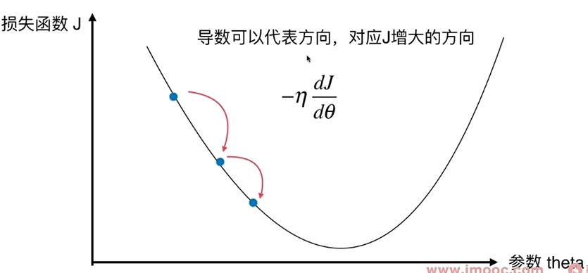
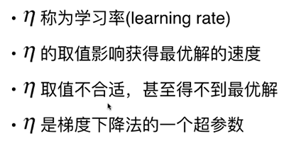
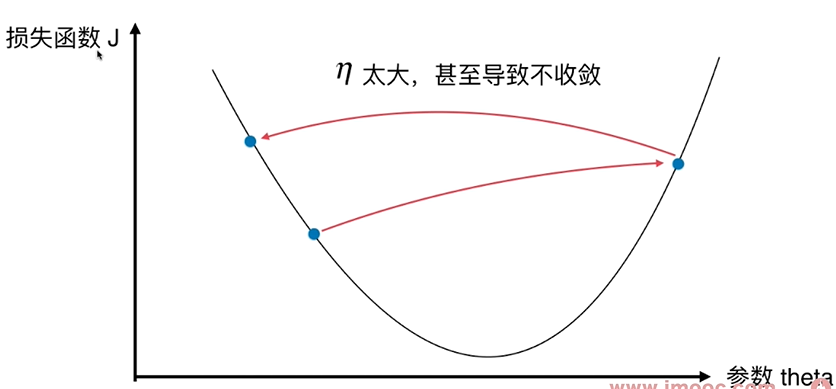
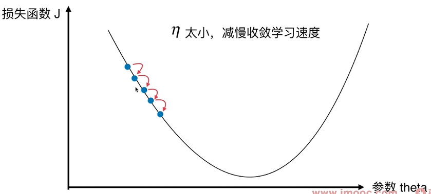
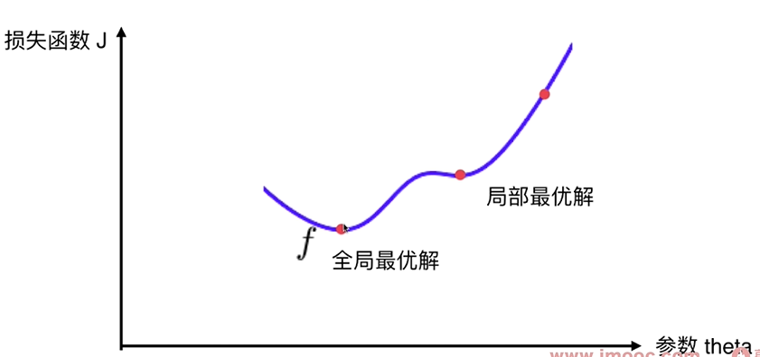

# 梯度下降法 - Gradient Descent

不是一个机器学习算法，不能解决分类，回归问题；

是一种基于搜索的最优化方法 - 最优化一个损失函数(loss function) - 在机器学习领域最小化损失函数的最为常用的一种方法  

最大化一个效用函数则用梯度上升法  

**很多模型得不到最优数学解，所以只能通过搜索策略找到最优解。**

寻找一个参数 $\theta$, 使得损失函数J取得最小值！

直线方程中，导数代表斜率， 在曲线方程中，导数代表切线斜率  

导数代表 $\theta$单位变化时，损失函数J相应的变化。 

导数可以代表方向，对应J增大的方向。   

导数为负值，则表示theta减小时，J增大；我们要想往J减小的方向前进，则 $\theta+一个导数*(-\eta)$。  

对多维函数来说，导数就是对应的梯度。   

$\eta$  - 步长  

把目标函数J当作一个山谷，一个球会自然的滚落下来，梯度下降法就好像在模拟这个球的滚落过程。 当球滚落到谷底时，相应的找到了J的最小值。滚落的速度由$ \eta $决定。 

并不是所有的函数都有唯一的极值点, 上图有2个极小值(导数=0)，这个极小值有可能只是局部最优解，而不是全局最优解 - 搜索过程中会遇到的问题

解决方案:  
    多次运行， 随机化初始点 - **初始点也是一个超参数**

**线性回归法的损失函数具有唯一的最优解。**

梯度下降法的超参数：  
   - eta - 步长  
   - 初始点  
