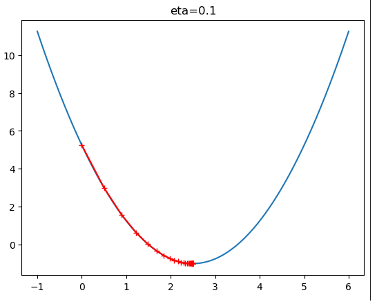
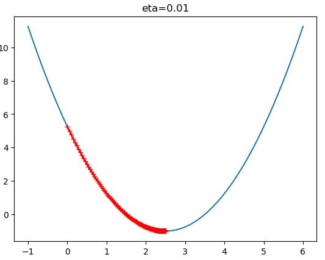
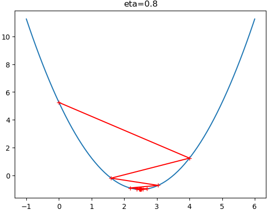
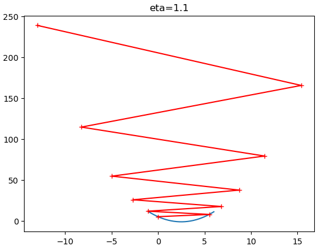

# 模拟实现梯度下降法  

```python
import numpy as np
import matplotlib.pyplot as plt
plot_x = np.linspace(-1, 6, 141)

def dJ(theta):#求theta点对应的梯度
    return 2*(theta - 2.5)

def J(theta):#损耗函数
    try:
        return (theta-2.5)**2 - 1
    except:
        return float('inf')

def gradient_descent(initial_theta, eta, n_iters=1e3, epsilon=1e-8):
    theta = initial_theta
    theta_history=[]
    theta_history.append(initial_theta)
    i_iter = 0
    while (i_iter < n_iters):
        last_theta = theta
        gradient = dJ(theta)
        theta = theta - eta*gradient
        theta_history.append(theta)
        if np.abs(J(theta) - J(last_theta)) < epsilon:
            break
        i_iter += 1
    return theta_history
    
def plot_theta_history():
    plt.plot(plot_x, J(plot_x))
    plt.plot(np.array(theta_history), J(np.array(theta_history)), color='r', marker='+')
   #plt.title("eta=0.1")

theta_history = gradient_descent(initial_theta=0, eta = 0.1, epsilon=1e-8)
plot_theta_history()
```

eta值会影响算法能否快速收敛:




