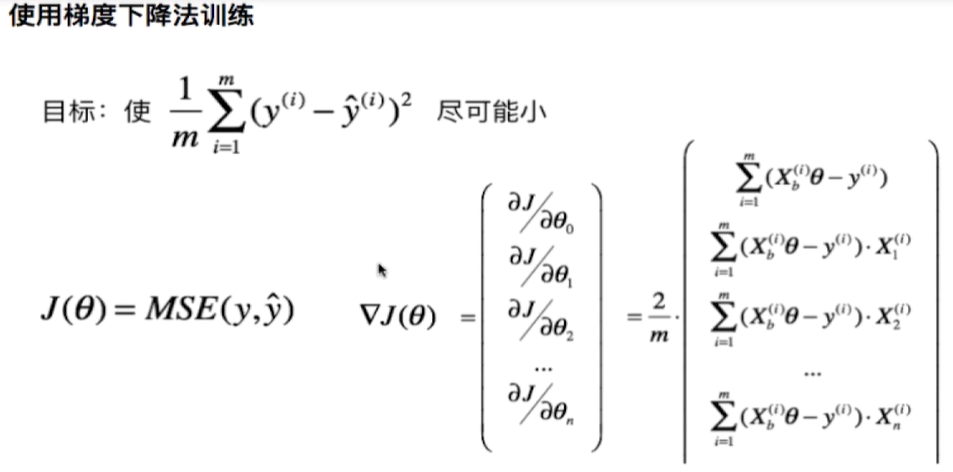
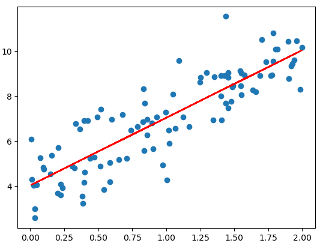

# 实现线性回归中的梯度下降法



在LinearRegression类中实现了fit_gd函数：

```python
    def fit_gd(self, X_train, y_train):
        assert X_train.shape[0] == y_train.shape[0], "The X_train's size should be equal to the y_train's size"
        def dJ(theta, X_b, y):
            gd = np.zeros_like(theta)
            for i in range(len(theta)):
                if i == 0:
                    gd[0] = np.sum((X_b.dot(theta) - y))
                else:
                    gd[i] = np.sum((X_b.dot(theta) - y).dot(X_b[:, i]))
            return gd * 2 / len(X_b)

        def J(theta, X_b, y):
            try:
                return np.sum((X_b.dot(theta) - y) ** 2) * 2 / len(X_b)
            except:
                return float('inf')

        def gradient_descent(X_b, y, initial_theta, eta, n_iters=1e4, epsilon=1e-8):
            theta = initial_theta
            i_iter = 0

            while (i_iter < n_iters):
                last_theta = theta
                gradient = dJ(theta, X_b, y)
                theta = theta - eta*gradient
                if np.abs(J(theta, X_b, y) - J(last_theta, X_b, y)) < epsilon:
                    break
                i_iter += 1
            return theta

        X_b = np.hstack((np.ones((len(X_train), 1)), X_train))
        initial_theta = np.zeros(X_b.shape[1])
        eta = 0.01
        self._theta = gradient_descent(X_b, y_train, initial_theta, eta)
        self.coef_ = self._theta[1:]
        self.intercept_ = self._theta[0]
        return self
```

测试代码:

```python
import numpy as np
import matplotlib.pyplot as plt
import sys
sys.path.append(r'C:\\N-20KEPC0Y7KFA-Data\\junhuawa\\Documents\\00-Play-with-ML-in-Python\\Jupyter')
import playML
from playML.LinearRegression import LinearRegression
lin_reg = LinearRegression()

np.random.seed(666)
x = 2*np.random.random(size=100)
y = x*3. + 4. + np.random.normal(size=100)
X = x.reshape(-1, 1)
lin_reg.fit_gd(X, y)
y_predict = x*lin_reg.coef_ + lin_reg.intercept_
plt.scatter(x, y)
plt.plot(x, y_predict, color='r')
lin_reg._theta
```
array([4.06880601, 3.08632808])

