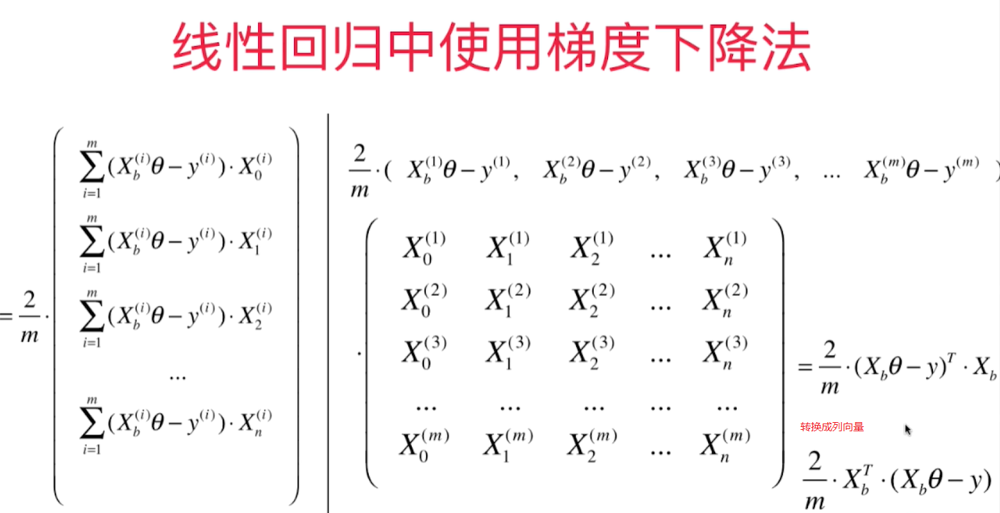
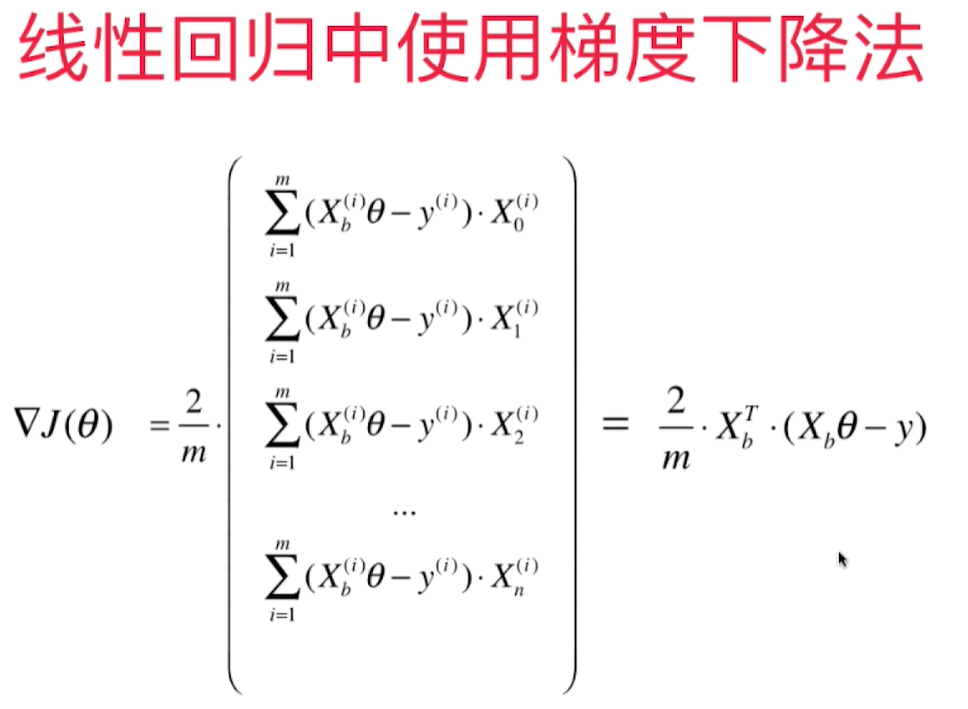
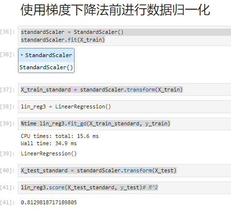

# 梯度下降法的向量化和数据标准化




# 用向量运算代替for循环

在Numpy里，一个向量默认都是列向量，要转换成行向量需要转置。但是Numpy里对于行，列向量的运算是一样的，不做区分。   

上一节求梯度的方法可以转换成简洁的矩阵运算：    
```python
        def dJ(theta, X_b, y):
            gd = np.zeros_like(theta)
            for i in range(len(theta)):
                if i == 0:
                    gd[0] = np.sum((X_b.dot(theta) - y))
                else:
                    gd[i] = np.sum((X_b.dot(theta) - y).dot(X_b[:, i]))
            return gd * 2 / len(X_b)
```
转换为:
```python
        def dJ(theta, X_b, y):
            return X_b.T.dot(X_b.dot(theta) - y) * 2. / len(X_b)  
``` 
最终的代码fit_gd()如下:
```python
    def fit_gd(self, X_train, y_train, eta = 0.1, n_iters=1e4):
        assert X_train.shape[0] == y_train.shape[0], "The X_train's size should be equal to the y_train's size"
        def dJ(theta, X_b, y):
            #         res = np.zeros_like(theta)
            #        gd = np.zeros_like(theta)

            #        for i in range(len(theta)):
            #            if i == 0:
            #                gd[0] = np.sum((X_b.dot(theta) - y))
            #            else:
            #               gd[i] = np.sum((X_b.dot(theta) - y).dot(X_b[:, i]))
            #        return gd * 2 / len(X_b)
            return X_b.T.dot(X_b.dot(theta) - y) * 2. / len(X_b)


        def J(theta, X_b, y):
            try:
                return np.sum((X_b.dot(theta) - y) ** 2) / len(X_b)
            except:
                return float('inf')

        def gradient_descent(X_b, y, initial_theta, eta, n_iters, epsilon=1e-8):
            theta = initial_theta
            i_iter = 0

            while (i_iter < n_iters):
                last_theta = theta
                gradient = dJ(theta, X_b, y)
                theta = theta - eta*gradient
                if np.abs(J(theta, X_b, y) - J(last_theta, X_b, y)) < epsilon:
                    break
                i_iter += 1
            return theta

        X_b = np.hstack((np.ones((len(X_train), 1)), X_train))
        initial_theta = np.zeros(X_b.shape[1])
        self._theta = gradient_descent(X_b, y_train, initial_theta, eta, n_iters)
        self.coef_ = self._theta[1:]
        self.intercept_ = self._theta[0]
        return self
```
boston房价数据读取和regression类加载:
```python
import numpy as np
from sklearn import datasets
import matplotlib.pyplot as plt
import pandas as pd
data= pd.read_csv("boston_house_prices.csv", skiprows=[0])
array = data.values
X = array[:, :13]
y = array[:, 13]
import sys
sys.path.append(r'C:\\N-20KEPC0Y7KFA-Data\\junhuawa\\Documents\\00-Play-with-ML-in-Python\\Jupyter')
import playML
from playML.model_selection import train_test_split
X_train, X_test, y_train, y_test = train_test_split(X, y, seed=666)
from playML.LinearRegression import LinearRegression

```

## 数据归一化

在真实数据中，每一维的数据大小相差很大，导致需要步长尽可能小（0.000001），回归次数（1e6）尽可能多才能达到理想的模型, 但是这样也会导致收敛速度很慢，计算量很大的问题。为了达到理想的效果，需要对数据进行归一化。归一化后，算法效率提高很多。  


梯度下降法和线性回归法（正规方程法）的比较：    
    - 正规方程解法中不需要对数据做归一化，因为求解只是对矩阵的运算，没有搜索的过程。 在GD中，步长会受到各个维度数据的影响。数据归一化可以解决这个问题，数据归一化后，收敛速度大幅提高！  
    - 正规方程法需要对m*n的矩阵做大量的乘法运算($O(n^3)$)，矩阵大时效率低。    
    - 但是对于梯度下降法，如果样本数量m增大，因为每次都要对所有样本进行计算，效率也会降低，所以引出了随机梯度下降法。    

```python  
from sklearn.preprocessing import StandardScaler
standardScaler = StandardScaler()
standardScaler.fit(X_train)
X_train_standard = standardScaler.transform(X_train)
lin_reg3 = LinearRegression()
%time lin_reg3.fit_gd(X_train_standard, y_train)
X_test_standard = standardScaler.transform(X_test)
lin_reg3.score(X_test_standard, y_test)# R^2
```


正规法和梯度下降法性能比较：
```python
m = 1000
n = 5000
big_X = np.random.normal(size=(m, n))
true_theta = np.random.uniform(0.0, 100.0, size=n+1)
big_y = big_X.dot(true_theta[1:]) + true_theta[0]+np.random.normal(0.0, 10., size=m)

big_reg1 = LinearRegression()
%time big_reg1.fit_normal(big_X, big_y)

big_reg2 = LinearRegression()
%time big_reg2.fit_gd(big_X, big_y)
```
结果：
CPU times: total: 14.8 s
Wall time: 5.1 s
CPU times: total: 11 s
Wall time: 3.49 s
总结： 当特征值和样本量数量很大时，GD性能比LR好！，但对于GD来说，如果样本量增大，他的性能也会减少，所以引入随机梯度下降法。一次只用计算一个样本的梯度。 
https://blog.csdn.net/hai411741962/article/details/132580367