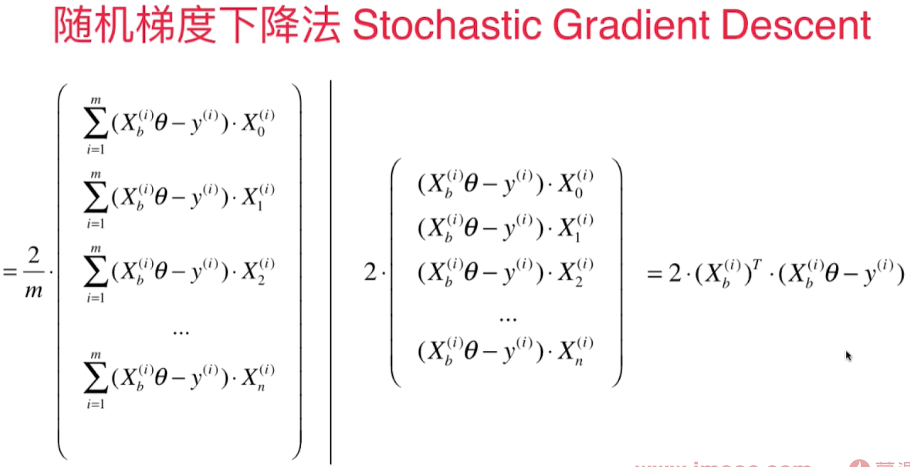
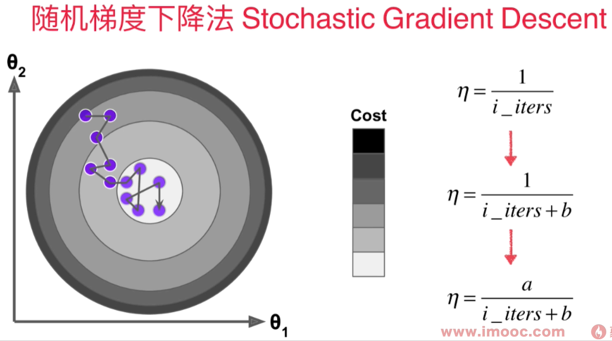

# 随机梯度下降法 Stochastic Gradient Descent(SGD)

每次只取出第i个样本进行计算，得到的值决定了下一次的搜索方向，有可能往梯度增大的方向前进，但是总的来说会逼近最小值。尤其是当样本数m值很大时，我们愿意用精度换取时间。

为了避免我们已经到loss function的最小值附近，但是因为学习率过大，导致又跳出了最小值附近，我们希望学习率是逐渐递减的。 而这个逐渐递减的过程借用了搜索领域著名的模拟退火思想。 
既在冶金的过程中，钢铁的温度是从高到低冷却的！冷却的函数是和时间t相关的。




用$1/3$的样本就可以得到较精确的结果：
``` python
import numpy as np
import matplotlib.pyplot as plt
m = 100000
x = np.random.normal(size=m)
X = x.reshape(-1, 1)
y = 4.*x + 3.+np.random.normal(0, 3, size=m)

def dJ_sgd(theta, X_b_i, y_i):
    return X_b_i.T.dot(X_b_i.dot(theta) - y_i) * 2.

def J(theta, X_b, y):
    try:
        return np.sum((X_b.dot(theta) - y) ** 2) / len(X_b)
    except:
        return float('inf')
        
def sgd(X_b, y, theta, n_iters):

    t0 = 5
    t1 = 50
    def learning_rate(t):
        return t0/(t + t1)
    
    for cur_iter in range(n_iters):
        rand_i = np.random.randint(len(X_b))
        gradient = dJ_sgd(theta, X_b[rand_i], y[rand_i])
        theta = theta - learning_rate(cur_iter) * gradient
    return theta

%%time
X_b = np.hstack([np.ones((len(X), 1)), X])
initial_theta = np.zeros(X_b.shape[1])
theta = sgd(X_b, y, initial_theta, len(X)//3)

theta
```
结果：

CPU times: total: 219 ms
Wall time: 368 ms

array([2.94080133, 4.02817242])
