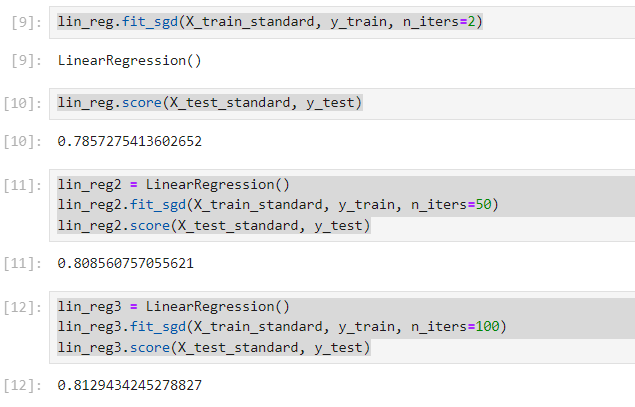

# scikit-learn 中的随机梯度下降法


不需要从外部传递eta，因为eta随着循环次数而变。
n_iters:代表对传入的所有的样本看几遍？比如5，看5遍，总的循环次数是n_iters*m
在每一遍遍历中，要对所有样本随机地看一遍。- 把所有样本先乱序排序，然后再从头开始取出每一个样本，这样就可以随机的把所有的样本看一遍。 
```python
        indexes = np.random.permutation(m)
```
fit_sgd() 函数实现: 
```python
    def fit_sgd(self, X_train, y_train, n_iters=5, t0 = 5, t1=50): #n_iters代表要遍历几遍所有的样本
        assert X_train.shape[0] == y_train.shape[0], "The X_train's size should be equal to the y_train's size"
        assert n_iters >= 1, "所有的样本至少要看一遍"
        def learning_rate(t, t0, t1):
            return t0 / (t + t1)

        def dJ_sgd(theta, X_b_i, y_i):
            return X_b_i.T.dot(X_b_i.dot(theta) - y_i) * 2.

        def sgd(X_b, y, theta, n_iters, t0, t1):
            m = len(X_b)
            for cur_iter in range(n_iters):
                indexes = np.random.permutation(m)
                X_b_new = X_b[indexes] #通过fancy indexing获得新的array
                y_new = y[indexes]
                for i in range(m):
                    gradient = dJ_sgd(theta, X_b_new[i], y_new[i])
                    theta = theta - learning_rate(cur_iter*m + i, t0, t1) * gradient
            return theta

        X_b = np.hstack([np.ones((len(X_train), 1)), X_train])
        initial_theta = np.zeros(X_b.shape[1])
        self._theta = sgd(X_b, y_train, initial_theta, n_iters, t0, t1)
        self.coef_ = self._theta[1:]
        self.intercept_ = self._theta[0]
        return self
```
测试数据 boston 房价：
```python
from sklearn import datasets
import matplotlib.pyplot as plt
import pandas as pd
data= pd.read_csv("boston_house_prices.csv", skiprows=[0])
array = data.values
X = array[:, :13]
y = array[:, 13]
X = X[y<50.0]
y = y[y<50.0]
```
测试训练数据集拆分：

```python
from playML.model_selection import train_test_split
X_train, X_test, y_train, y_test = train_test_split(X, y, seed = 666)
```


对数据进行归一化处理:
```python
from sklearn.preprocessing import StandardScaler
standardScaler = StandardScaler()
standardScaler.fit(X_train)
X_train_standard = standardScaler.transform(X_train)
X_test_standard = standardScaler.transform(X_test)
```
拟合并测试$R^2$ Score:
``` python
from playML.LinearRegression import LinearRegression
lin_reg = LinearRegression()
lin_reg.fit_sgd(X_train_standard, y_train, n_iters=2)
lin_reg.score(X_test_standard, y_test)

lin_reg2 = LinearRegression()
lin_reg2.fit_sgd(X_train_standard, y_train, n_iters=50)
lin_reg2.score(X_test_standard, y_test)

lin_reg3 = LinearRegression()
lin_reg3.fit_sgd(X_train_standard, y_train, n_iters=100)
lin_reg3.score(X_test_standard, y_test)
```



### scikit-learn中的SGD
```python
from sklearn.linear_model import SGDRegressor
sgd_reg = SGDRegressor(max_iter=100)
sgd_reg.fit(X_train_standard, y_train)
sgd_reg.score(X_test_standard, y_test)
```
结果:

0.8122765915486065