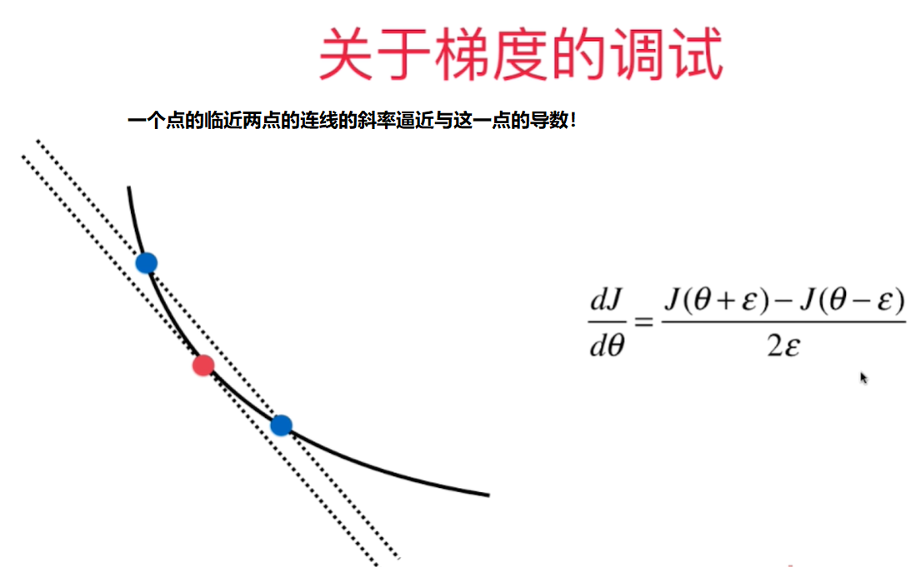
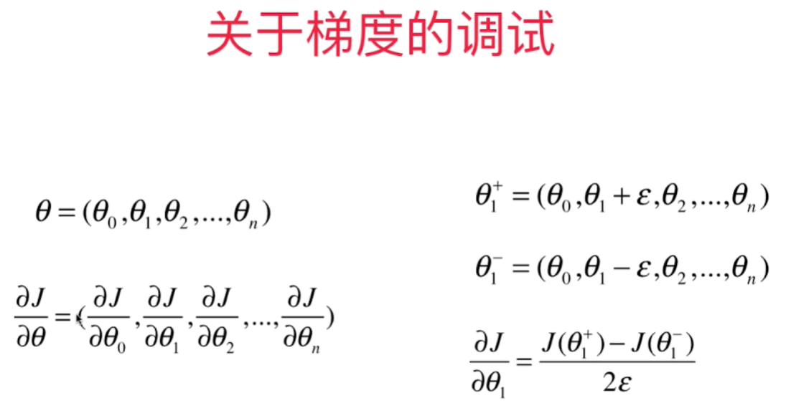

# 如何判断梯度下降法中梯度值是正确的？ 

Debug的时候，可以用极限求导的定义来算出梯度值（效率低），用来验证向量化矩阵运算获得的梯度值是否正确。  




```python
def J(theta, X_b, y):
    try:
       return np.sum((X_b.dot(theta) - y) ** 2) / len(X_b)
    except:
       return float('inf')

def dJ_math(theta, X_b, y): # 用矩阵运算求导
    return X_b.T.dot(X_b.dot(theta) - y) * 2. / len(X_b)
    
def dJ_debug(theta, X_b, y, epsilon=0.01): # 用极限方法求导
    res = np.empty(len(theta))
    for i in range(len(theta)):
       theta_1 = theta.copy()
       theta_2 = theta.copy()
       theta_1[i] += epsilon
       theta_2[i] -= epsilon
       res[i] = (J(theta_1, X_b, y) - J(theta_2, X_b, y)) /(2*epsilon)
    return res

# implemnented in playML.LinearRegression
def fit_gd_debug(self, dJ, X_train, y_train, n_iters=1e4):
    assert X_train.shape[0] == y_train.shape[0], "The X_train's size should be equal to the y_train's size"

    def gradient_descent(dJ, X_b, y, initial_theta, eta, n_iters, epsilon=1e-8):
        theta = initial_theta
        i_iter = 0

        while (i_iter < n_iters):
            last_theta = theta
            gradient = dJ(theta, X_b, y)
            theta = theta - eta*gradient
            if np.abs(J(theta, X_b, y) - J(last_theta, X_b, y)) < epsilon:
                break
            i_iter += 1
        return theta

    X_b = np.hstack((np.ones((len(X_train), 1)), X_train))
    initial_theta = np.zeros(X_b.shape[1])
    eta=0.01
    self._theta = gradient_descent(dJ, X_b, y_train, initial_theta, eta,  n_iters)
    self.coef_ = self._theta[1:]
    self.intercept_ = self._theta[0]
    return self
```

测试代码：
```python
import numpy as np
import matplotlib.pyplot as plt
np.random.seed(666)
X=np.random.random(size=(1000,10))
true_theta = np.arange(1, 12, dtype=float)
X_b = np.hstack([np.ones((len(X), 1)), X])
y = X_b.dot(true_theta) + np.random.normal(size=1000)
import sys
sys.path.append(r'C:\\N-20KEPC0Y7KFA-Data\\junhuawa\\Documents\\00-Play-with-ML-in-Python\\Jupyter')
import playML
from playML.LinearRegression import LinearRegression

lin_reg1 = LinearRegression()
lin_reg1.fit_gd_debug(dJ_math, X, y)
lin_reg1._theta

lin_reg2 = LinearRegression()
lin_reg2.fit_gd_debug(dJ_debug, X, y)
lin_reg2._theta
```