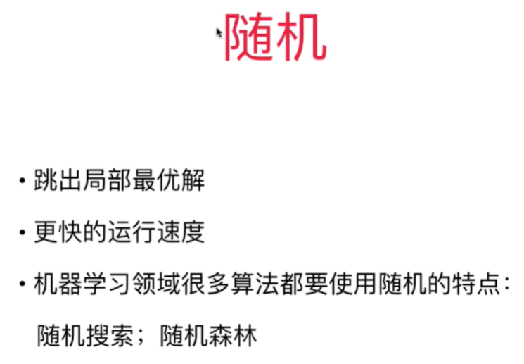

# 小批量梯度下降法

# 

批量梯度下降法 Batch Gradient Descent - 每次对所有样本做运算，效率低但是稳定，总是向损失函数下降的方向前进！
随机梯度下降法 Stochastic Gradient Descent - 计算速度快，但是不稳定，甚至有可能向反方向前进。 
小批量梯度下降法 mini-batch Gradient Descent - 每次看K个样本，兼顾了速度，得到的梯度也比SGD稳定一些 - 超参数K

随机能帮我们跳出局部最优解。机器学习解决的是在不确定的世界中的不确定的问题。本身就没有一个固定的最优解！

