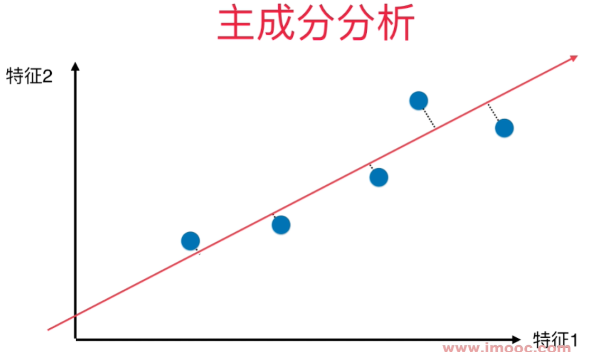

# PCA - 主成分分析 - Principal Component Analysis

研究生阶段的数理统计课程覆盖PCA。 

如何找到让样本间间距最大的轴 - 方差(Variance) - 描述整体样本疏密的指标, 大代表样本稀疏，小代表样本越紧密。

$$
\begin{aligned}
Var(x) = \frac{1}{m}\sum_{i=1}^m(x_i-\bar x)^2 && (1)
\end{aligned}
$$

横轴纵轴代表两个特征，将2维平面降到1维平面，用一条线去拟合原来的那些点，这些映射到这条线上的点与原来的2维的样本点没有更大的差距。点和点之间的距离比原来将点映射到X轴或者Y轴都大，点之间的区分度也更加明显。 

对所有的样本进行demean处理 - 归零 - 每个样本都减去样本均值. 坐标轴进行了移动，使得样本在每一个维度上的均值为0.

$X_i$ 是将原来的样本点映射到斜线（新的坐标轴）上之后得到的的新的样本值(w1, w2)

使2个向量相减之后的模的平方达到最大值

因为$X_{project}$做过demean处理，均值为0， 所以

把所有的样本点映射到w轴上之后得到的新的样本点的模的平方和最大。

要求
$$
\begin{aligned}
Var(X_{project})=\frac{1}{m}\sum_{i=1}^m\Vert X^{(i)}\cdot w\Vert^2
\end{aligned}
$$
最大！

**主成分分析法**：找到一个轴，使得样本空间的所有点映射到这个轴后，方差最大。 所有的点的距离线垂直于找到的线。

**线性回归**：找到一根直线，使的输出标记和所有在X轴上的特征值对应的直线上的点之间的MSE尽量小。这些距离线垂直于X轴。 

两者都有样本和一根直线之间的关系，但是关系是不同的。

