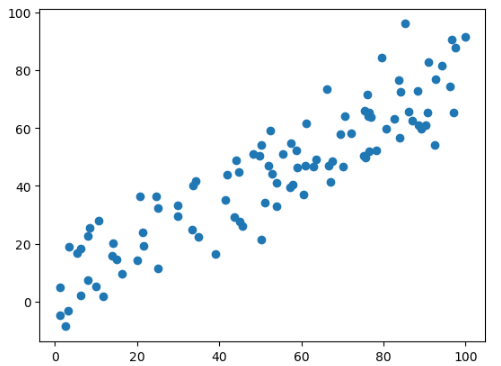
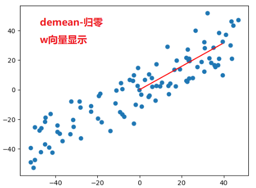

# 求数据主成分PCA

求解梯度上升法的注意事项：
 - 每一次都要求出w的一个单位方向向量，因为算法里要求的就是单位向量， 如果不用单位向量，搜索会不稳定。 
 - 初始搜索的w不能为0,要随机化一个向量。 为0的向量得到的梯度也为0. 
 - 不能使用standardScaler标准化数据， 如果先对数据进行标准化，则不是一个线性的变化，会影响数据的分布， 得到的主成分和原始的数据不一样。 
 demean只是把数据在坐标轴上进行位移，不影响数据的分布，所以可以操作。 

 我们通过PCA求得的这个单位向量（轴）就是第一个主成分。 
PCA是一种无监督学习，因为算法中不需要y. 

 ```python
 def demean(X):
    return X - np.mean(X, axis = 0)

  def f(X, w):
        return np.sum(X.dot(w) ** 2) / len(X)

    def df_math(X, w):
        return X.T.dot(X.dot(w)) * 2 / len(X)

    def df_debug(X, w, epsilon=0.0001):  # w是一个方向向量，模为1，每个维度的值都很小, 所以epsilon的值也小
        res = np.empty(len(w))
        for i in range(len(w)):
            w_1 = w.copy()
            w_2 = w.copy()
            w_1[i] += epsilon
            w_2[i] -= epsilon
            res[i] = (f(X, w_1) - f(X, w_2)) / (2 * epsilon)
        return res

    def direction(w):  # 求单位向量
        return w / np.linalg.norm(w)

    def gradient_ascent(df, X, initial_w, eta, n_iters=1e4, epsilon=1e-8):
        w = direction(initial_w)
        i_iter = 0

        while (i_iter < n_iters):
            last_w = w
            gradient = df(X, w)
            w = w + eta * gradient
            w = direction(w)
            if np.abs(f(X, w) - f(X, last_w)) < epsilon:
                break
            i_iter += 1
        return w
```

```python
import numpy as np
import matplotlib.pyplot as plt
X = np.empty((100, 2))
X[:, 0] = np.random.uniform(0, 100, size=100)
X[:, 1] = 0.75*X[:, 0] + 3.0 + np.random.normal(0, 10, size=100)
def demean(X): #需要对原始数据做demean处理 - 归零
    return X - np.mean(X, axis = 0)
X_demean = demean(X)

initial_w = np.random.random(X.shape[1])
w = gradient_ascent(df_math, X_demean, initial_w, eta)

plt.scatter(X_demean[:, 0], X_demean[:, 1])
plt.plot((0, w[0] * 50), (0, w[1]*50), color='r')
```



