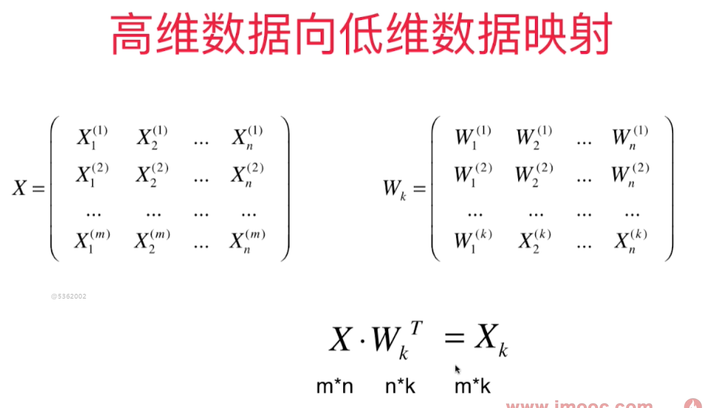
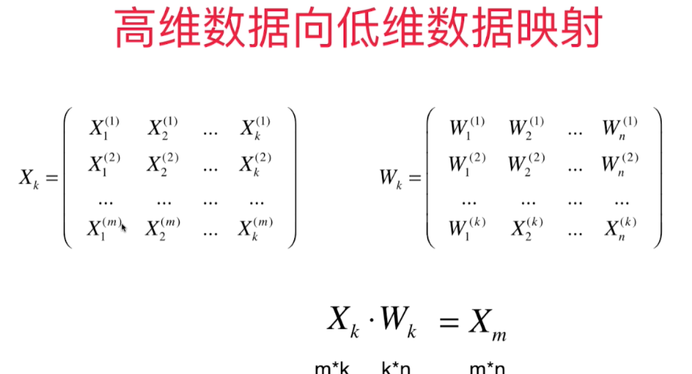
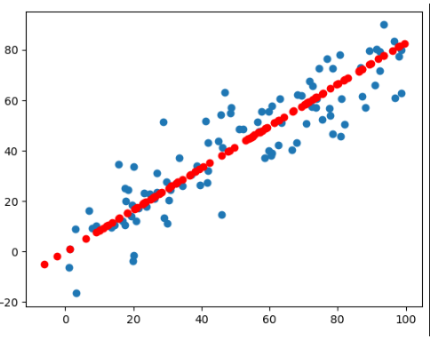

# 高维数据向低维数据映射

k 个主成分，每个主成分都是n维的。主成分分析的目的就是**把样本从一个坐标系转换到另一个坐标系。** 我们只取出前k个主成分（每个主成分的坐标轴有n个元素），因为这个前k个特征特别重要。形成W这个矩阵，这个矩阵是k*n的。

样本1和k个W相乘的结果就是样本1映射到 $W_k$ 这个坐标系上得到的k维的向量。 k 比n小，所以完成了一个样本从n维到k维(高维向低维)的映射。 


高维向低维映射



也可以从低维恢复到高维，但是降维时丢失的信息无法恢复



求出k个主成分得到$W_k$这个矩阵，得到K个轴的单位方向向量之后，就可以从高维向低维数据的映射，也可以反过来从低维映射回高维数据。 


封装的PCA类包含**fit, transform, inverse_transform** 函数：
```python
import numpy as np

class PCA:
    def __init__(self, n_components):
        """初始化PCA模型"""
        assert n_components >= 1, "n_components must be bigger than 0."
        self.n_components = n_components
        self.components_ = None

    def fit(self, X, eta = 0.01, n_iters = 1e4):
        assert self.n_components <= X.shape[1], "n_components must be not bigger than the feature number of X."
        def f(X, w):
            return np.sum(X.dot(w) ** 2) / len(X)
        def df(X, w):
            return X.T.dot(X.dot(w)) * 2 / len(X)
        def direction(w):  # 求单位向量
            return w / np.linalg.norm(w)
        def demean(X):  # 需要对原始数据做demean处理 - 归零
            return X - np.mean(X, axis=0)
        def first_component(X, initial_w, eta=0.001, n_iters=1e4, epsilon=1e-8):
            w = direction(initial_w)
            i_iter = 0
            while (i_iter < n_iters):
                last_w = w
                gradient = df(X, w)
                w = w + eta * gradient
                w = direction(w)
                if np.abs(f(X, w) - f(X, last_w)) < epsilon:
                    break
                i_iter += 1
            return w

        X_pca = demean(X)
        self.components_ = np.empty(shape=(self.n_components, X.shape[1]))
        for i in range(self.n_components):
            initial_w = np.random.random(X_pca.shape[1])
            w = first_component(X_pca, initial_w)
            self.components_[i, :] = w
            X_pca = X_pca - (X_pca.dot(w)).reshape(-1, 1) * w
        return self

    def transform(self, X):
        """将给定的X映射到各主成分分量中"""
        assert self.components_.shape[1] == X.shape[1], "n_components must be equal to the feature number of X."
        return X.dot(self.components_.T)

    def inverse_transform(self, X_k):
        """将给定的X_k反向映射到原来的特征空间"""
        assert self.components_.shape[0] == X_k.shape[1], "n_components must be equal to the feature number of X_k."
        return X_k.dot(self.components_)
    def first_n_components(n, X, eta = 0.001, n_iters=1e4, epsilon=1e-8):

        def first_component(X, initial_w, eta=0.001, n_iters=1e4, epsilon=1e-8):
            def f(X, w):
                return np.sum(X.dot(w) ** 2) / len(X)

            def df(X, w):
                return X.T.dot(X.dot(w)) * 2 / len(X)

            def direction(w):  # 求单位向量
                return w / np.linalg.norm(w)

            w = direction(initial_w)
            i_iter = 0

            while (i_iter < n_iters):
                last_w = w
                gradient = df(X, w)
                w = w + eta * gradient
                w = direction(w)
                if np.abs(f(X, w) - f(X, last_w)) < epsilon:
                    break
                i_iter += 1
            return w

        def demean(X):  # 需要对原始数据做demean处理 - 归零
            return X - np.mean(X, axis=0)

        X_pca = X.copy()
        res = []
        X_pca = demean(X_pca)
        for i in range(n):
            initial_w = np.random.random(X_pca.shape[1])
            w = first_component(X_pca, initial_w)
            res.append(w)
            X_pca = X_pca - (X_pca.dot(w)).reshape(-1, 1) * w

        return res

    def __repr__(self):
        return "PCA(n_components = %d)" % self.n_components
```

测试代码：
```python
import numpy as np
import matplotlib.pyplot as plt
import sys
sys.path.append(r'C:\\N-20KEPC0Y7KFA-Data\\junhuawa\\Documents\\00-Play-with-ML-in-Python\\Jupyter')
import playML
from playML.pca import PCA
X = np.empty((100, 2))
X[:, 0] = np.random.uniform(0, 100, size=100)
X[:, 1] = 0.75*X[:, 0] + 3.0 + np.random.normal(0, 10, size=100)

pca = PCA(n_components = 1)
pca.fit(X)
X_reduction = pca.transform(X)
X_restore = pca.inverse_transform(X_reduction)
X_restore.shape
plt.scatter(X[:, 0], X[:, 1])
plt.scatter(X_restore[:, 0], X_restore[:, 1], color='r')
```

虽然恢复成2维的样本数据，但是显然他的原始数据信息已经丢失了。 

