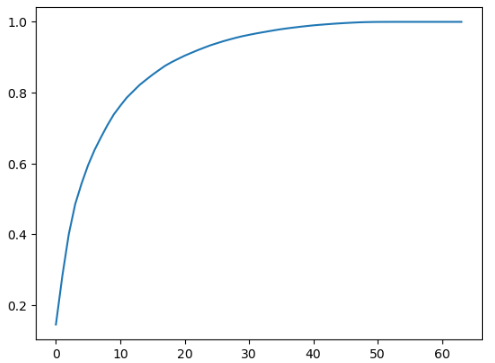

# scikit-learn中的PCA

scikit-learn中的PCA不是通过梯度上升法求解，而是用其他数学方法求的，所以求出的主成分方向和梯度上升法得到的不一样，但不影响降维结果。

pca.explained_variance_ratio_解释的方差相应的比例

array([0.14566817, 0.13735469])

第一个轴可以解释14%的源数据的方差，第二个轴可以解释13%的源数据的方差。 用这个数组可以画出前k个主成分包含信息的多少：

```python
from sklearn.decomposition import PCA
import numpy as np
from sklearn import datasets
digits = datasets.load_digits()
X = digits.data
y = digits.target
from sklearn.model_selection import train_test_split
X_train, X_test, y_train, y_test = train_test_split(X, y, random_state=666)
pca = PCA(X.shape[1])
pca.fit(X_train)
import matplotlib.pyplot as plt
plt.plot([i for i in range(X_train.shape[1])], [np.sum(pca.explained_variance_ratio_[:i+1]) for i in range(X_train.shape[1])])
```



可以往PCA构造函数中传入期望保留的信息比率，然后倒推主成分的数量：
```python
pca = PCA(0.95)# 不知道要取多少个主成分,但是期望能得到95%的方差,也即能保留样本95%的信息
pca.fit(X_train)
pca.n_components_
```
结果：
28

用降维（64维降到28维）后的样本做分类得到的score, 速度也提高了一个数量级:
```python
from sklearn.decomposition import PCA
import numpy as np
from sklearn.model_selection import train_test_split
X_train, X_test, y_train, y_test = train_test_split(X, y, random_state=666)
pca = PCA(0.95)# 不知道要取多少个主成分,但是期望能得到95%的方差,也即能保留样本95%的信息
pca.fit(X_train)
X_train_reduction = pca.transform(X_train)
X_test_reduction = pca.transform(X_test)
%%time
knn_clf_pca = KNeighborsClassifier()
knn_clf_pca.fit(X_train_reduction, y_train)
knn_clf_pca.score(X_test_reduction, y_test)
```
Result: 
CPU times: total: 625 ms
Wall time: 150 ms
0.98