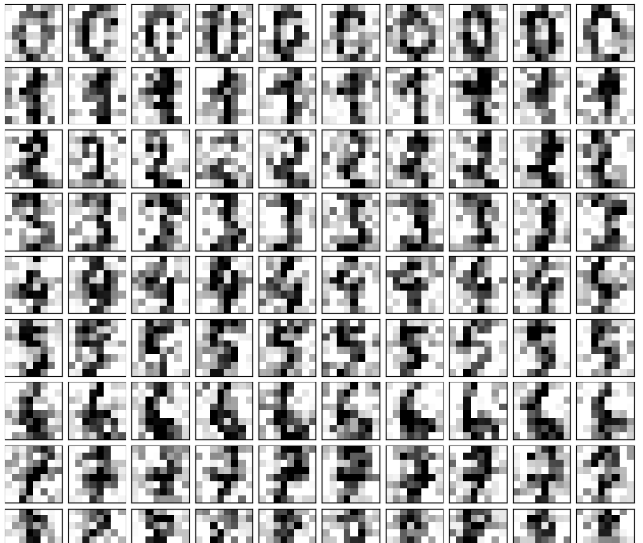
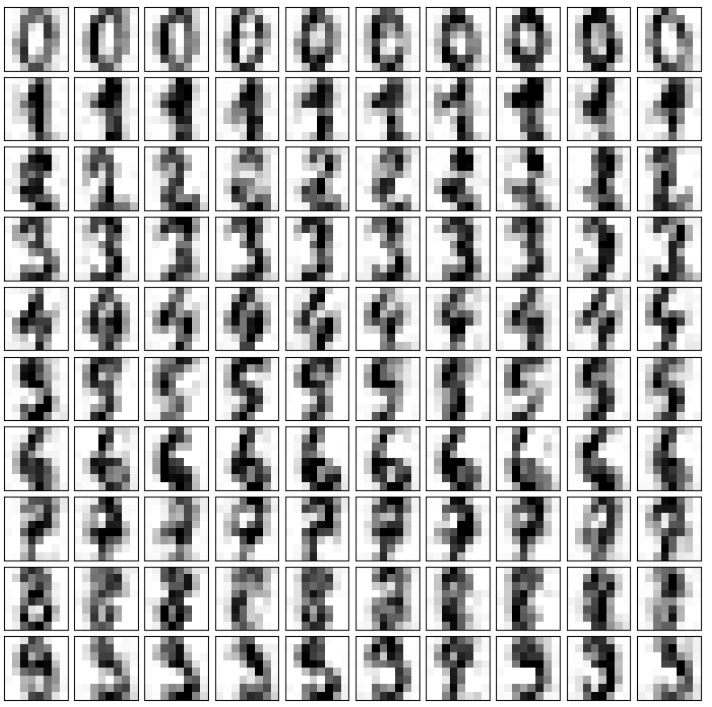

# 使用PCA降噪

用sklearn里手写识别的例子

生成10*10的降噪图像，取100个图像样本，每个数字有10幅图像
```python
from sklearn import datasets
digits = datasets.load_digits()
X = digits.data
y = digits.target
noisy_digits = X + np.random.normal(0, 4, size = X.shape) #生成携带噪音的数据
#取出100个数据图像，每个数字10个
example_digits = noisy_digits[y==0, :][:10]
for num in range(1, 10):
    X_num = noisy_digits[y==num, :][:10]
    example_digits = np.vstack([example_digits, X_num])

#绘制10*10图像	
def plot_digits(data):
    fig, axes = plt.subplots(10, 10, figsize=(10, 10), subplot_kw={'xticks':[], 'yticks':[]}, gridspec_kw=dict(hspace=0.1, wspace=0.1))
    for i, ax in enumerate(axes.flat):
        ax.imshow(data[i].reshape(8, 8), cmap='binary', interpolation='nearest', clim=(0, 16))
		
plot_digits(example_digits)		
```


如果保留90%的数据，则绘出的图像和原来的图像很像，降噪不明显. 
当保留50%的信息时，维度从64维降到12维。

```python
from sklearn.decomposition import PCA
pca = PCA(0.5) 
pca.fit(noisy_digits)
digits_reduction = pca.transform(example_digits)#12维
filtered_digits = pca.inverse_transform(digits_reduction)
plot_digits(filtered_digits)
```

