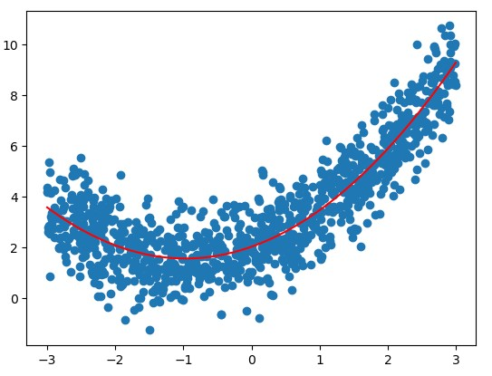

# Scikit-Learn 中的多项式回归和Pipeline

对于2次幂的特征,如果原本有 $x_1$, $x_2$ 2个特征的话, 最终会生成3列二次幂的特征！${x_1}^2$, $x_2^2$, $x_1$ * $x_2$ 这样3个特征, 经过transform之后生成了6个特征(原来的2个特征加上0次幂的特征,和生成的3个特征). 

传入的degree=i时,经过多项式拟合后会生成 <= i的所有的项, 特征成指数级增长. 


### 手动创建PolynomialFeatures类

```python
import numpy as np
import matplotlib.pyplot as plt
from sklearn.preprocessing import PolynomialFeatures
x = np.random.uniform(-3, 3, size=100)
X = x.reshape(-1, 1)
y = 0.5*x**2 + x+2+np.random.normal(0, 1, 100)
poly = PolynomialFeatures(degree=2)
poly.fit(X)
X2 = poly.transform(X)
X2[:5,:] #X2的前5行
X[:5, :]**2
```
下面输出结果可见：
    - 第一列是x的0次幂的特征
    - 第二列是x的1次幂的特征值
    - 第三列是x的二次幂的特征值
```python
array([[ 1.        ,  2.06105838,  4.24796164],
       [ 1.        ,  0.80578448,  0.64928863],
       [ 1.        , -2.95353343,  8.7233597 ],
       [ 1.        , -1.18450125,  1.40304321],
       [ 1.        ,  0.6798243 ,  0.46216109]])
array([[4.24796164],
       [0.64928863],
       [8.7233597 ],
       [1.40304321],
       [0.46216109]])
```
### 拟合
```python
from sklearn.linear_model import LinearRegression
lin_reg2 = LinearRegression()
lin_reg2.fit(X2, y)
y_predict2 = lin_reg2.predict(X2)
plt.scatter(x, y)
plt.plot(np.sort(x), y_predict2[np.argsort(x)], color='r')
lin_reg2.coef_
lin_reg2.intercept_
```
输出结果：

```python
array([0.        , 0.9887805 , 0.47970716])
2.0822081391267404
```


### Pipeline
如果数据大小相差比较大，经过多项式回归会放大这个差距，所以需要用scalar先做归一化，再送给线性回归。  

使用pipeline可以很方便的创建多项式回归这样一个类，这个类sklearn没有提供。 

```python
import numpy as np
import matplotlib.pyplot as plt
from sklearn.preprocessing import PolynomialFeatures
x = np.random.uniform(-3, 3, size=100)
X = x.reshape(-1, 1)
y = 0.5*x**2 + x+2+np.random.normal(0, 1, 100)
from sklearn.pipeline import Pipeline
from sklearn.preprocessing import StandardScaler
from sklearn.linear_model import LinearRegression
poly_reg = Pipeline([
    ("poly", PolynomialFeatures(degree=2)),
    ("std_scaler", StandardScaler()),
    ("lin_reg", LinearRegression())
])
poly_reg.fit(X, y)
y_predict = poly_reg.predict(X)

plt.scatter(x, y)
plt.plot(np.sort(x), y_predict[np.argsort(x)], color='r')
```
结果:


### 归一化和未归一化得到的斜率和截距不一样

```python
import numpy as np
import matplotlib.pyplot as plt
from sklearn.preprocessing import PolynomialFeatures
from sklearn.linear_model import LinearRegression
x = np.random.uniform(-3, 3, size=1000)
X = x.reshape(-1, 1)
y = 0.5*x**2 + x+2+np.random.normal(0, 1, 1000)
poly = PolynomialFeatures(degree=2)
poly.fit(X)
X2 = poly.transform(X)
stdscalar = StandardScaler()
stdscalar.fit(X2)
std_X2 = stdscalar.transform(X2)
lin_reg2 = LinearRegression()
lin_reg2.fit(std_X2, y)
y2 = lin_reg2.predict(std_X2)
plt.scatter(x, y)
plt.plot(np.sort(x), y2[np.argsort(x)], color='r')
lin_reg2.coef_
lin_reg2.intercept_
```
```python
array([0.        , 1.65391099, 1.29661475])
3.485295640277668
```
