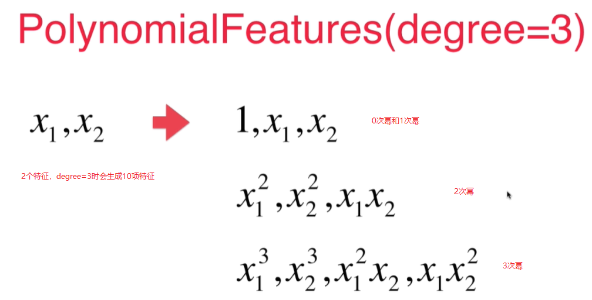
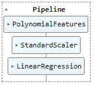
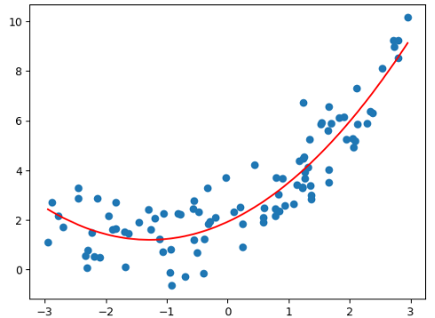

# Scikit-Learn 中的多项式回归和Pipeline

对于2次幂的特征,如果原本有 $X_1$, $X_2$ 2个特征的话, ${X_1}^2$, $X_2^2$, $X_1$ * $X_2$ 这样3个特征, 经过transform之后生成了6个特征(原来的2个特征加上0次幂的特征,和生成的3个特征). 


使用pipeline可以很方便的创建多项式回归这样一个类，这个类sklearn没有提供。 

```python
import numpy as np
import matplotlib.pyplot as plt
from sklearn.preprocessing import PolynomialFeatures
x = np.random.uniform(-3, 3, size=100)
X = x.reshape(-1, 1)
y = 0.5*x**2 + x+2+np.random.normal(0, 1, 100)
from sklearn.pipeline import Pipeline
from sklearn.preprocessing import StandardScaler
poly_reg = Pipeline([
    ("poly", PolynomialFeatures(degree=2)),
    ("std_scaler", StandardScaler()),
    ("lin_reg", LinearRegression())
])
poly_reg.fit(X, y)
y_predict = poly_reg.predict(X)

plt.scatter(x, y)
plt.plot(np.sort(x), y_predict[np.argsort(x)], color='r')
```
结果:





