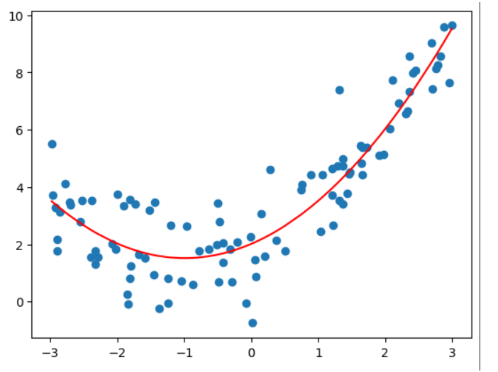
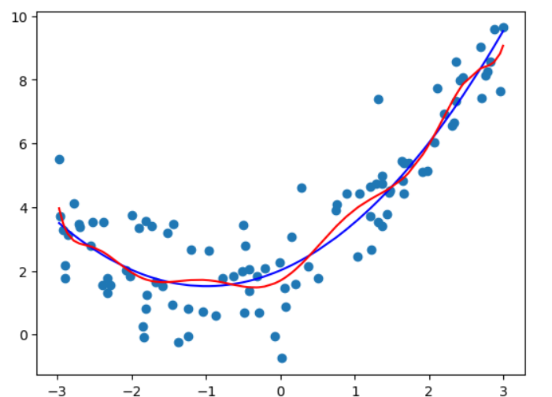
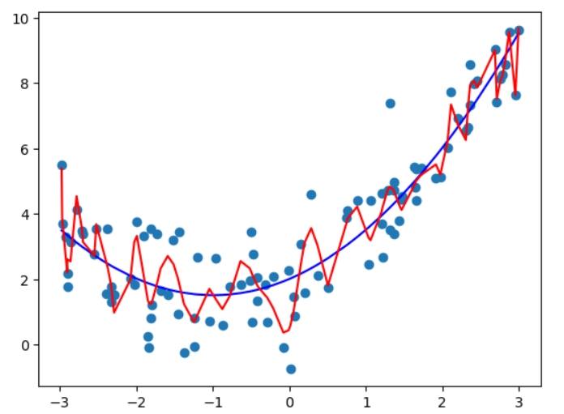
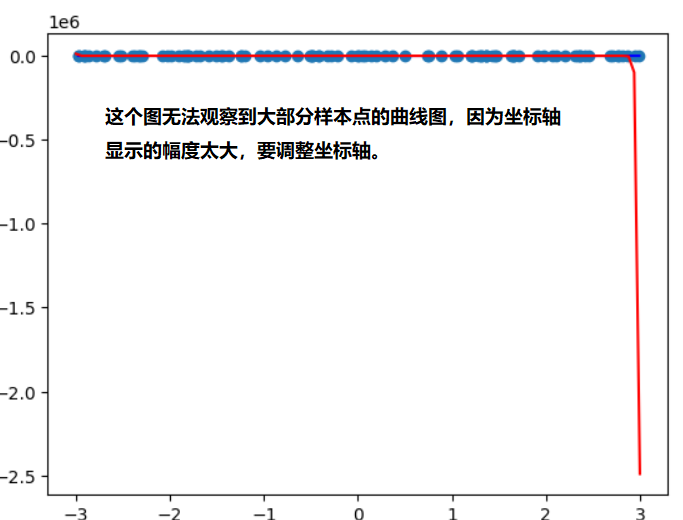
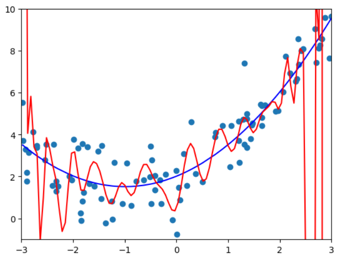

# 过拟合与欠拟合 (Underfitting-and-overfitting)


均方误差

非常高维的数据拟合了我们的数据 （度为10 或者100或者更高），拟合效果越好。可以找到以条曲线，将所有的样本点拟合进这条曲线(所有的样本点都在这条曲线上)，均方误差为0，  但是不是我们想要的, 曲线变得太过复杂了。 他可能不能反映我们样本的真实趋势。 Overfitting - 过拟合

用直线拟合数据，没有反应原始数据的样本特征 欠拟合 - underfitting

用pipeline得出度为2,10,100的时候的预测曲线:

测试用例：

```python
import numpy as np
import matplotlib.pyplot as plt
from sklearn.linear_model import LinearRegression
np.random.seed(666)
x = np.random.uniform(-3, 3, size=100)
X = x.reshape(-1, 1)
y = 0.5*x**2 + x + 2 + np.random.normal(0, 1, size=100)
```

Pipeline:

```python
from sklearn.pipeline import Pipeline
from sklearn.preprocessing import PolynomialFeatures
from sklearn.preprocessing import StandardScaler

def PolynomialRegression(degree):
	return Pipeline([
		("poly", PolynomialFeatures(degree = degree)),
		("std_scaler", StandardScaler()), 
		("lin_reg", LinearRegression())
		])
```

```python
#degree = 2
poly_reg2 = PolynomialRegression(2)
poly_reg2.fit(X, y)
y_predict2 = poly_reg2.predict(X)
plt.scatter(x, y)
plt.plot(np.array(np.sort(x)), y_predict2[np.argsort(x)], color='r')
#degree = 10
poly_reg10 = PolynomialRegression(10)
poly_reg10.fit(X, y)
y_predict10 = poly_reg10.predict(X)
plt.scatter(x, y)
plt.plot(np.array(np.sort(x)), y_predict2[np.argsort(x)], color='b')
plt.plot(np.array(np.sort(x)), y_predict10[np.argsort(x)], color='r')
# degree = 100
poly_reg100 = PolynomialRegression(100)
poly_reg100.fit(X, y)
y_predict100 = poly_reg100.predict(X)
plt.scatter(x, y)
plt.plot(np.array(np.sort(x)), y_predict2[np.argsort(x)], color='b')
plt.plot(np.array(np.sort(x)), y_predict100[np.argsort(x)], color='r')
```








因为$x$数组的值不是均匀分布的，所以对于100度的真实曲线不是上图所示的，为了显示出真实的曲线，需要用均匀分布的x来画:

```python
new_x = np.linspace(-3, 3, 100)
X_new = new_x.reshape(-1, 1)
y_new_100 = poly_reg100.predict(X_new)
plt.scatter(x, y)
plt.plot(np.array(np.sort(x)), y_predict2[np.argsort(x)], color='b')
plt.plot(np.array(X_new[:, 0]), y_new_100, color='r')
```


调整坐标轴后的结果：

```python
plt.scatter(x, y)
plt.plot(np.array(np.sort(x)), y_predict2[np.argsort(x)], color='b')
plt.plot(np.array(X_new[:, 0]), y_new_100, color='r')
plt.axis([-3, 3, -1, 10])
```


