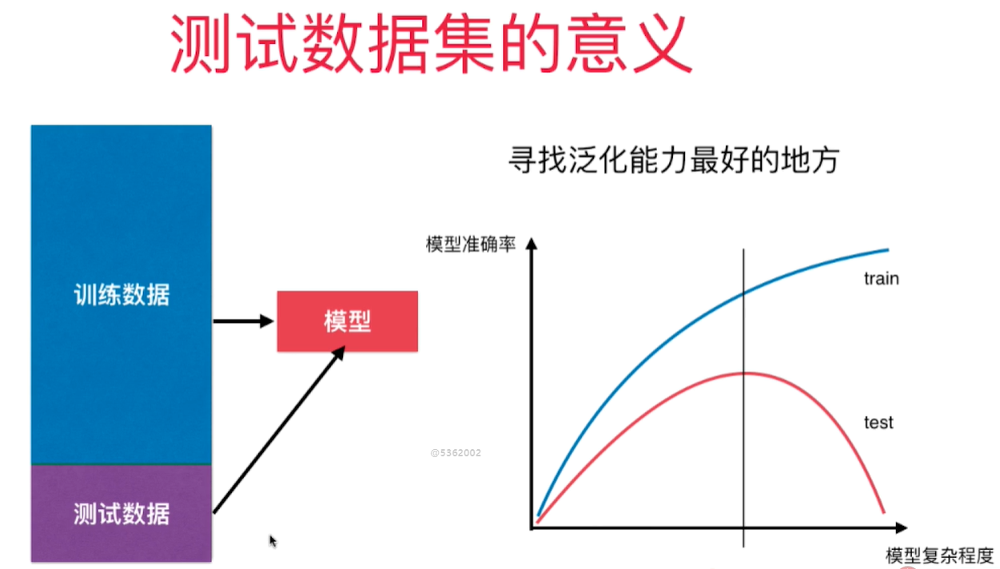

# 训练数据集和测试数据集

机器学习主要解决过拟合问题。 
过拟合情况下，原有样本点拟合的很好，但是新样本点却不能很好的预测。 - 模型的泛化能力差 - 由此及彼的能力差(面对新样本的时候能力差)

要得到好的泛化能力 - 需要训练测试数据集的分离 - 对测试数据结果好的话则泛化能力强，否则则有可能遭遇了过拟合。 

用训练得到的模型获得测试数据集的样本的预测值，然后和测试数据集的原标签值做均方差 - mean squared error
过拟合 overfitting - 算法所训练的模型过多的表达了数据间的噪音关系。 
欠拟合 underfitting - 算法所训练的模型不能完整表述数据关系

