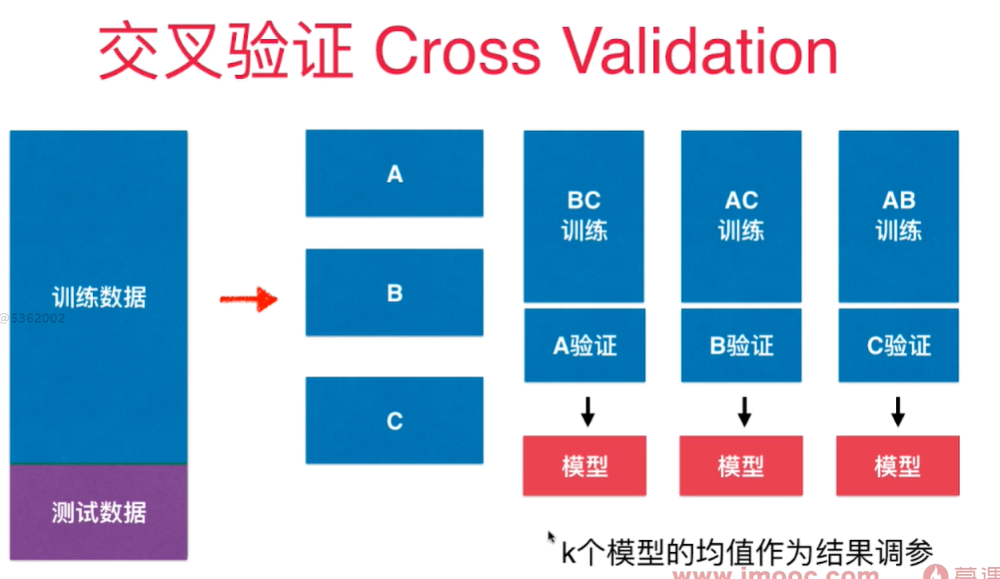
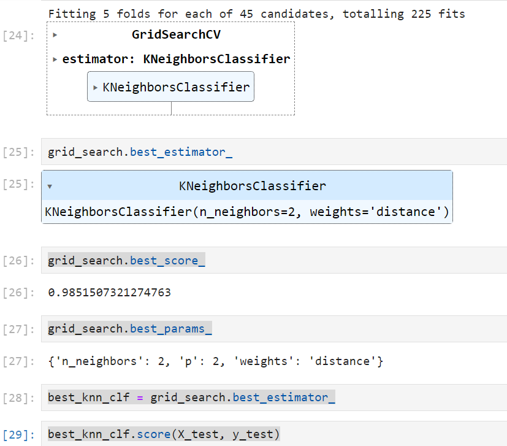

# 验证数据集与交叉验证

训练测试数据集分离可能导致过拟合特定的测试数据， 模型围绕着测试数据集打转！针对这个特定测试数据集进行调参。- 过拟合

将数据集分成3部分： 训练数据集，验证数据集(Validation dataset)，和测试数据集
原来的测试数据集用验证数据集来代替，参与模型的创建, 调整超参数，而测试数据集只是作为**衡量最终模型性能的数据集！**

为了避免对特定验证数据集过拟合，引入了交叉验证的方式 - Cross Validation

cross_val_score() 默认情况下将训练数据集分成5分，做交叉验证, 返回5个fold对应的score值. 



k-folds交叉验证，把数据分成k份，每一份是一个fold。缺点是每次要训练k个模型， 整体性能下降k倍。
极端情况下， 有一个留一法LOO-CV(Leave-one-out cross validation) - 训练集共有m个样本，就将训练数据集分成m份，每次将m-1份样本用于训练， 预测剩下的1个样本。 将这些预测结果做平均，用于衡量模型预测的准确度。 - 完全不受随机的影响， 计算量巨大。 
学术论文中可能会采用这个方法用于验证严谨性。 

用手写数字集做手动交叉验证:
```python
import numpy as np
from sklearn import datasets
digits = datasets.load_digits()
X = digits.data
y = digits.target

from sklearn.model_selection import train_test_split
X_train, X_test, y_train, y_test = train_test_split(X, y, test_size=0.4, random_state=666)
from sklearn.model_selection import cross_val_score

from sklearn.neighbors import KNeighborsClassifier
best_score, best_k, best_p = 0, 0, 0
for k in range(2, 11):
    for p in range(1, 6):
        knn_clf = KNeighborsClassifier(weights="distance", n_neighbors=k, p=p)
        scores = cross_val_score(knn_clf, X_train, y_train)
        score = np.mean(scores)
        if score > best_score:
            best_score, best_k, best_p = score, k, p
print("Best K = ", best_k)
print("Best P = ", best_p)
print("Best Score = ", best_score)

best_knn_clf = KNeighborsClassifier(weights="distance", n_neighbors=2, p=2)
best_knn_clf.fit(X_train, y_train)
best_knn_clf.score(X_test, y_test)
```
结果：
```c
Best K =  2
Best P =  2
Best Score =  0.9851507321274763
0.980528511821975
```


网格搜索：

```python
from sklearn.model_selection import GridSearchCV
param_grid = [
    {
        "weights":['distance'],
        'n_neighbors':[i for i in range(2, 11)],
        'p': [i for i in range(1, 6)]
    }
]

grid_search = GridSearchCV(knn_clf, param_grid, verbose=1)
grid_search.fit(X_train, y_train)
grid_search.best_score_
grid_search.best_params_
best_knn_clf = grid_search.best_estimator_
best_knn_clf.score(X_test, y_test)
```
结果：



0.980528511821975


