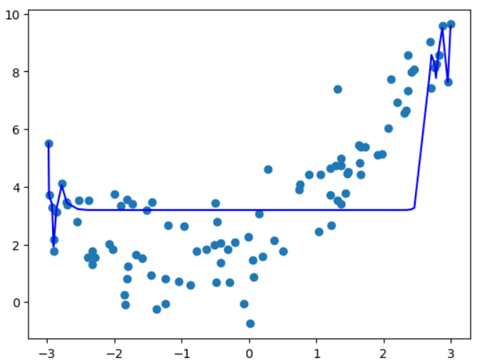

Curve not right!!!
```python
import numpy as np
import matplotlib.pyplot as plt
from sklearn.linear_model import LinearRegression
from sklearn.preprocessing import PolynomialFeatures
np.random.seed(666)
x = np.random.uniform(-3, 3, size=100)
X = x.reshape(-1, 1)
y = 0.5*x**2 + x + 2 + np.random.normal(0, 1, size=100)


poly100_reg = PolynomialFeatures(degree=100)
poly100_reg.fit(X)
X_100 = poly100_reg.transform(X)

lin100_reg = LinearRegression()
lin100_reg.fit(X_100, y)
y100_predict = lin100_reg.predict(X_100)
plt.scatter(x, y)
plt.plot(np.array(np.sort(x)), y100_predict[np.argsort(x)], color='b')
```

