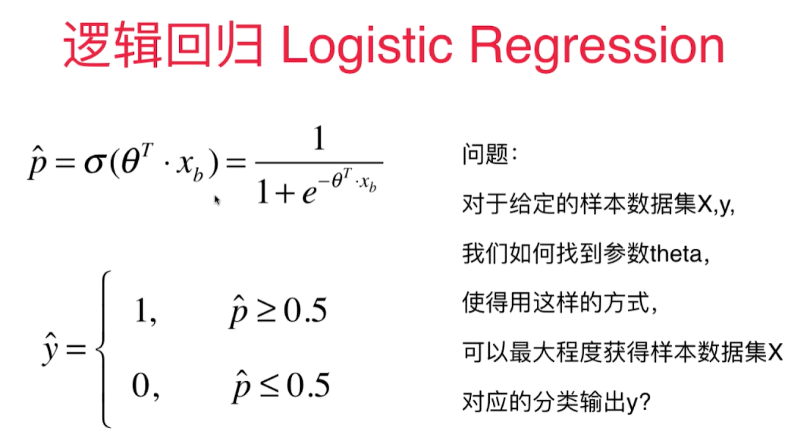
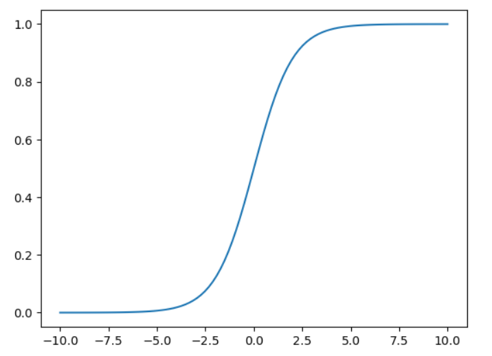

# 逻辑回归算法 - Logistic Regression

也称为Logit回归

用于解决分类问题,将样本特征和样本发生的概率联系起来. 用于估算一个实例属于某个特定类别的概率。- 是一个二元分类器

首先通过sigmoid函数获得样本对应的属于某个特定值的概率p，然后再根据概率获得 $\hat y$.


$$\hat p = h_{\theta}(x) = \sigma(x^T\theta)$$

$\theta(.)$  是一个sigmoid函数，输出一个介于0/1之间的数字。




Sigmoid函数:

$$\sigma(t) = \frac{1}{1+e^{-t}}$$

```python
import numpy as np
import  matplotlib.pyplot as plt
def sigmoid(x):
    return 1/(1 + np.exp(-x))
x = np.linspace(-10, 10, 100)
y = sigmoid(x)
plt.plot(x, y)
```

