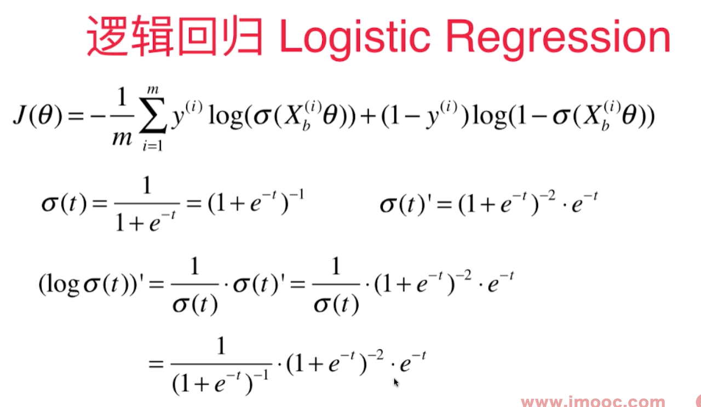
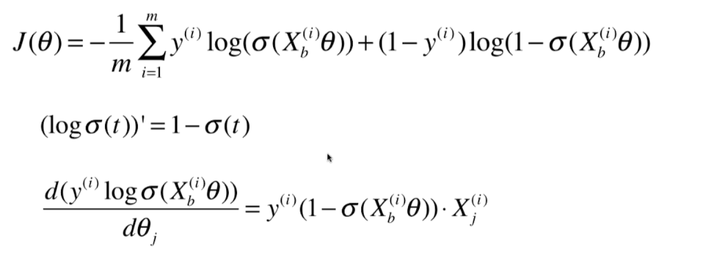
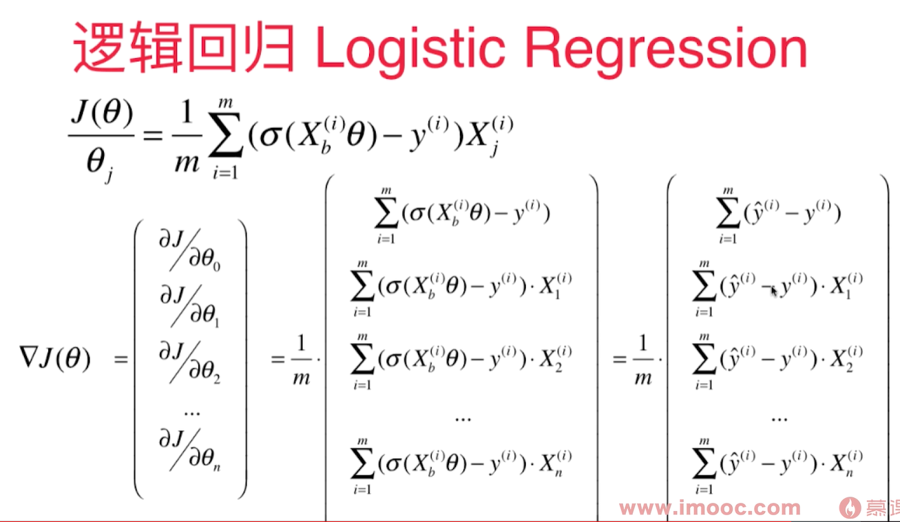

# 逻辑回归损失函数的梯度

逻辑回归中的梯度公式和线性回归中的梯度公式很像：

2个向量里有共通的部分，每个向量里都有y的预测值( $\hat y$ ) - y 的真值，再乘以 $X_i$ 的第j个维度。然后$\sum$求和，除以m。

对于线性回归：

$$\hat y = X_b^{i}\theta$$

对于逻辑回归：

$$\hat y = \sigma(X_b^{i}\theta)$$

线性回归多出一个2. 

向量化的梯度求解：

线性回归梯度求解：

