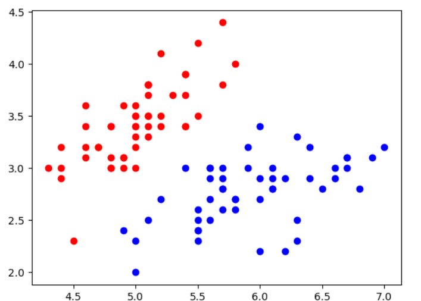

# 实现逻辑回归算法


基于LinearRegression的code实现的LogisticRegression：

```python
import numpy as np
#from .metrics import r2_score


class LogisticRegression:

    def __init__(self):
        """初始化Logistic Regression模型"""
        self.coef_ = None
        self.intercept_ = None
        self._theta = None

    def _sigmoid(self, x):
        return 1 / (1 + np.exp(-x))
    def predict_proba(self, X_predict):
        """给定待预测数据集X_predict，返回表示X_predict的预测概率向量"""
        assert self.intercept_ is not None and self.coef_ is not None, \
            "must fit before predict!"
        assert X_predict.shape[1] == len(self.coef_), \
            "the feature number of X_predict must be equal to X_train"

        X_b = np.hstack([np.ones((len(X_predict), 1)), X_predict])
        return self._sigmoid(X_b.dot(self._theta))
    def predict(self, X_predict):
        """给定待预测数据集X_predict，返回表示X_predict的预测结果向量"""
        assert self.intercept_ is not None and self.coef_ is not None, \
            "must fit before predict!"
        assert X_predict.shape[1] == len(self.coef_), \
            "the feature number of X_predict must be equal to X_train"

        X_b = np.hstack([np.ones((len(X_predict), 1)), X_predict])
        proba = self.predict_proba(X_predict)
        return np.array(proba >= 0.5, dtype = 'int')
    def score(self, X_test, y_test):
        """根据测试数据集 X_test 和 y_test 确定当前模型的准确度"""

        y_predict = self.predict(X_test)
        #return accuracy_score(y_test, y_predict)

    def __repr__(self):
        return "LogisticRegression()"

    def fit(self, X_train, y_train, eta = 0.01, n_iters=1e4):
        assert X_train.shape[0] == y_train.shape[0], "The X_train's size should be equal to the y_train's size"

        def dJ(theta, X_b, y):
           return X_b.T.dot(self._sigmoid(X_b.dot(theta)) - y) / len(y)
        def J(theta, X_b, y):
            try:
                y_hat = self._sigmoid(X_b.dot(theta))
                sum = np.sum(y*np.log(y_hat) + (1 - y)*log(1 - y_hat))
                return -1 * sum/len(y)
            except:
                return float('inf')

        def gradient_descent(X_b, y, initial_theta, eta, n_iters, epsilon=1e-8):
            theta = initial_theta
            i_iter = 0

            while (i_iter < n_iters):
                last_theta = theta
                gradient = dJ(theta, X_b, y)
                theta = theta - eta*gradient
                if np.abs(J(theta, X_b, y) - J(last_theta, X_b, y)) < epsilon:
                    break
                i_iter += 1
            return theta

        X_b = np.hstack((np.ones((len(X_train), 1)), X_train))
        initial_theta = np.zeros(X_b.shape[1])
        self._theta = gradient_descent(X_b, y_train, initial_theta, eta, n_iters)
        self.coef_ = self._theta[1:]
        self.intercept_ = self._theta[0]
        return self
```

类的成员函数的参数都以 self开始。

iris测试代码：

```python
import numpy as np
import matplotlib.pyplot as plt
import sys
sys.path.append(r'C:\\N-20KEPC0Y7KFA-Data\\junhuawa\\Documents\\00-Play-with-ML-in-Python\\Jupyter')
import playML
from playML.LogisticRegression import LogisticRegression
log_reg = LogisticRegression()
from sklearn import datasets
iris = datasets.load_iris()
X = iris.data
y = iris.target
X = X[y<2, :2]#因为逻辑回归只能做二分类，所以只取前2种数据
y = y[y < 2]
plt.scatter(X[y==0, 0], X[y==0, 1], color='r')
plt.scatter(X[y==1, 0], X[y==1, 1], color='b')
from sklearn.model_selection import train_test_split
X_train, X_test, y_train, y_test = train_test_split(X, y)
log_reg.fit(X_train, y_train)
y_predict = log_reg.predict_proba(X_test)
y_hat = log_reg.predict(X_test)
```

