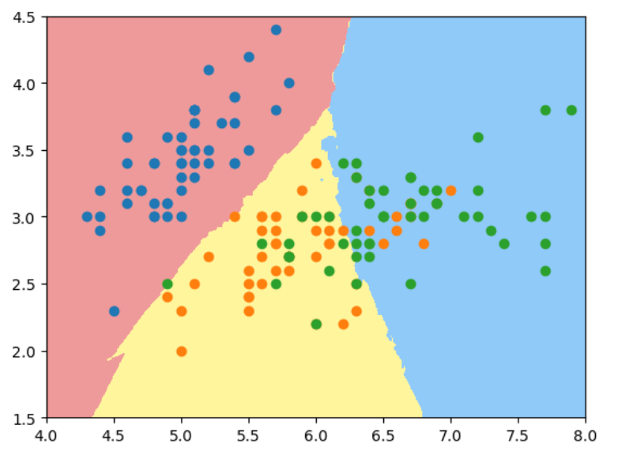

# 决策边界 - Decision Boundary

逻辑回顾算法也有系数和截距，这些theta的值有什么几何意义呢？

逻辑回归算出每个样本的概率$\hat p$, $\hat p$的值以0.5为界, >= 0.5判定为1， < 0.5 判定为0. 所以0.5对应着决策边界， 0.5意味着$\theta^T\cdot x_b = 0$, 这个点被称为决策边界。

对于$X$有2个特征的情况:

$$\theta_0 + \theta_1 x_1 + \theta_2 x_2 = 0$$

$$x_2 = \frac {-(\theta_0 + \theta_1 x_1)} {\theta_2}$$


鸢尾花数据集2个特征情况下的决策边界：
```python
import numpy as np
import matplotlib.pyplot as plt
import sys
sys.path.append(r'C:\\N-20KEPC0Y7KFA-Data\\junhuawa\\Documents\\00-Play-with-ML-in-Python\\Jupyter')
import playML
from playML.LogisticRegression import LogisticRegression
log_reg = LogisticRegression()
from sklearn import datasets
iris = datasets.load_iris()
X = iris.data
y = iris.target
X = X[y<2, :2]#因为逻辑回归只能做二分类，所以只取前2种数据
y = y[y < 2]
from sklearn.model_selection import train_test_split
X_train, X_test, y_train, y_test = train_test_split(X, y, random_state=666)
log_reg.fit(X_train, y_train)
theta0 = log_reg.intercept_
theta1 = log_reg._theta[1]
theta2 = log_reg._theta[2]
x2 = (-theta0 - theta1 * X[:, 0])/theta2
plt.scatter(X[y==0, 0], X[y==0, 1], color='r')
plt.scatter(X[y==1, 0], X[y==1, 1], color='b')
plt.plot(X[:, 0], x2)

```


如果只显示测试数据的话，可以看到2种类型的点被边界完美区分，所以测试score = 1.0.


不规则的决策边界绘制方法：
kNN 算法也是分类算法，也有决策边界，只是它的决策边界不是一条直线。这种不规则边界可以用下面 plot_decision_boundary()函数来绘制：
```python
def plot_decision_boundary(model, axis):
    x0, x1 = np.meshgrid(
        np.linspace(axis[0], axis[1], int((axis[1] - axis[0])*100)).reshape(-1, 1), 
        np.linspace(axis[2], axis[3], int((axis[3] - axis[2])*100)).reshape(-1, 1)
    )
    X_new = np.c_[x0.ravel(), x1.ravel()]

    y_predict = model.predict(X_new)
    zz = y_predict.reshape(x0.shape)

    from matplotlib.colors import ListedColormap
    custom_cmap = ListedColormap(['#EF9A9A', '#FFF59D', '#90CAF9'])
    plt.contourf(x0, x1, zz, cmap=custom_cmap)
```

对于kNN 分类算法,使用默认n_neighbors时得到的决策边界如下:
```python
from sklearn.neighbors import KNeighborsClassifier
knn_clf = KNeighborsClassifier()
knn_clf.fit(X, y)
plot_decision_boundary(knn_clf, axis=[4, 7.5, 1.5, 4.5])
plt.scatter(X[y==0, 0], X[y==0, 1], color='r')
plt.scatter(X[y==1, 0], X[y==1, 1], color='b')
```


如果用2维特征样本分类3种鸢尾花, 使用默认n_neighbors, 过拟合明显：
```python
X = iris.data[:, :2]
y = iris.target
knn_clf_all = KNeighborsClassifier()
knn_clf_all.fit(X, y)
plot_decision_boundary(knn_clf_all, axis=[4, 8, 1.5, 4.5])
plt.scatter(X[y==0, 0], X[y==0, 1])
plt.scatter(X[y==1, 0], X[y==1, 1])
plt.scatter(X[y==2, 0], X[y==2, 1])
```


当我们将n_neighbors增大到50时：
```python
knn_clf_50 = KNeighborsClassifier(n_neighbors = 50)
knn_clf_50.fit(X, y)
plot_decision_boundary(knn_clf_50, axis=[4, 8, 1.5, 4.5])
plt.scatter(X[y==0, 0], X[y==0, 1])
plt.scatter(X[y==1, 0], X[y==1, 1])
plt.scatter(X[y==2, 0], X[y==2, 1])
```


**结论：** 对于kNN算法，k的值越大，模型越简单，越不容易过拟合。 
